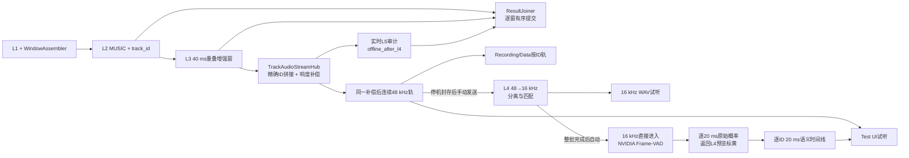

# 6+1 麦克风阵列项目 1.3.3：MUSIC 与公开方向 ID 架构

状态：**项目`1.3.3`开发线已开始；最终发布基线为`v1.3.2`。真实阵列、诊室声场与长时间运行验收仍按本文门禁继续执行，不以自动测试替代。**

开发版本：项目`1.3.3`，尚未创建发布标签；最终基线`v1.3.2`固定指向本次发布提交。不得移动、覆盖或重写已经发布的`v1.0.1`、`v1.1.1`、`v1.1.2`、`v1.2.1`、`v1.2.2`、`v1.2.3`、`v1.2.4`、`v1.3.1`、`v1.3.2`及其他历史标签。

适用范围：Layer 1～Layer 5、Windowing、Application Runtime、Development Test UI、Production UI、RecordingStore、数据管理、独立 Pipeline Log UI、测试与资产。

面向首次接触项目的可视化总图、逐层输入/输出/内部处理单元和操作流程见[`docs/COMPLETE_ARCHITECTURE_AND_USAGE.md`](docs/COMPLETE_ARCHITECTURE_AND_USAGE.md)。本文继续作为1.3.3开发契约，使用手册不建立第二份配置来源。

覆盖规则：本文件是 **1.1系列架构** 的权威契约；各目录README必须明确区分“代码已实现”“自动验收已完成”和“尚待实机验收”，不得把自动测试写成真实环境已通过。

## 1. 改造目标与非目标

1. 用宽带 MUSIC/NormMUSIC 替换 L2 的 SRP-PHAT 定位主链，并直接支持 0～3 个同时存在的方向峰。
2. 删除 iterative multiple peak 开关、配置、UI 和算法路径；多声源能力由 MUSIC 空间谱、声源数估计和圆周峰值筛选统一提供。
3. 将方向 ID 追踪设为正式主链默认启用的L2权威能力；使用Circular IMM-JPDA完成track/new/false/miss概率关联、静止/慢速移动模型融合及生命周期，正确处理 `359° ↔ 0°`、候选排序变化、新 ID、短时漏检和超时后重新编号。Development Test UI可临时关闭整套追踪；该诊断模式不得向L3/L5发布无权威ID的方向。
4. IMM是ID追踪器的固有组成，不再提供独立Kalman开关或Q/R运行时参数。
5. ID 从 L2 的私有 UI sidecar 元数据升级为 L2、L3、L5、Runtime、时间线、正式记录和逐 ID 试听共同使用的公共字段。
6. Test UI 根据 L2 的权威 ID 拼接 L3 音频；删除 UI 自己的二次角度关联、别名合并和贪心补救。
7. 录音管理和 Production UI 能按会话与 ID 查询方向时间线、L5 判断及增强音频，并提供逐 ID 试听。
8. 新增与 L1～L5、Test UI、录音存储系统平行的独立 Pipeline Log UI，只通过公开只读接口统计和回看会话，不进入、控制或反压实时处理链。

这里的 `track_id` 是**阵列方向轨迹 ID**，不是人的生物身份或说话人身份。在两个声源处于同一方向、近距离交叉或空间证据不足时，系统不能承诺保持真实人物身份不交换。

## 2. 论文与开源实现依据

- MUSIC 的基础定义采用 R. O. Schmidt 的经典论文：[Multiple Emitter Location and Signal Parameter Estimation](https://codar.com/images/about/1986Schmidt_MUSIC.pdf)。
- 宽带实现优先参考 Pyroomacoustics 的公开源码：[MUSIC](https://github.com/LCAV/pyroomacoustics/blob/master/pyroomacoustics/doa/music.py)、[frequency-normalized MUSIC](https://github.com/LCAV/pyroomacoustics/blob/master/pyroomacoustics/doa/normmusic.py) 和 [DOA example](https://github.com/LCAV/pyroomacoustics/blob/master/examples/doa_algorithms.py)。本项目应提炼算法和测试方法，不直接引入不必要的完整运行时依赖。
- 声源数估计以 Wax/Kailath 的 MDL 方法为第一实现依据：[Detection of Signals by Information Theoretic Criteria](https://doi.org/10.1109/TASSP.1985.1164557)。
- 相干声源和强混响下若普通宽带 MUSIC 不稳定，CSSM 作为后续增强候选，而不是本轮第一实现：[Coherent signal-subspace processing](https://doi.org/10.1109/TASSP.1985.1164667)。
- Israel Cohen 的工作优先用于本项目的噪声统计、校准、鲁棒性和反馈思路。公开资料入口见 [Israel Cohen publications](https://israelcohen.com/publications/all-publications/) 和 [Source Localization with Feedback Beamforming](https://israelcohen.com/wp-content/uploads/2018/05/Source-Localization-with-FeedbackBeamforming-Thesis-Itay-Yehezkel-Karo.pdf.pdf)。检索阶段未发现可直接替换当前 L2 的 Cohen MUSIC 开源实现，因此不得虚构“Cohen MUSIC 代码”来源；实现以标准 MUSIC/NormMUSIC 为主，并复用现有 Cohen IMCRA 噪声估计结果。
- 全局关联使用 SciPy [`linear_sum_assignment`](https://docs.scipy.org/doc/scipy/reference/generated/scipy.optimize.linear_sum_assignment.html) 求解线性和分配问题。工程文档可称“匈牙利式全局一对一分配”，但代码注释应准确说明 SciPy 当前实现为改进 Jonker–Volgenant 算法，而不是声称调用了特定内部实现。
- JPDA的联合假设、漏检和杂波结构参考[Stone Soup](https://github.com/dstl/Stone-Soup)；IMM的模型混合、模型概率更新结构参考[FilterPy IMMEstimator](https://github.com/rlabbe/filterpy/blob/master/filterpy/kalman/IMM.py)；观测的track/new/false分类思想参考[ODAS](https://github.com/introlab/odas)。本项目没有引入这些完整运行时依赖，也没有复制其三维追踪代码，而是按最多4轨/3观测边界实现圆周角专用版本。

所有借鉴的代码必须核对许可证，并在实现文件和第三方声明中保留必要来源信息。

## 3. 目标主链

```text
48 kHz HostAudio [N,8]
    ↓
L1：解码、校准、逻辑重排、连续性检查、IMCRA、可选预降噪
    ↓
WindowAssembler：每20 ms发布一次、包含最近160 ms的DecisionWindow
    ↓
L2：Probability Gate
    → 7麦多帧STFT与频点协方差
    → 宽带frequency-normalized MUSIC 0～359°空间谱
    → MDL/跨频一致性估计0～6阶空间模态
    → MDL只作诊断；effective_order=Test UI手动上限1/2/3
    → 候选仍限制为0～3个方向
    → 圆周峰值与50° NMS
    → 默认启用的Circular IMM-JPDA方向ID（Test UI诊断模式可旁路）
    → TrackedDirection + active_tracks
    ↓
L3：按同一WindowKey和track_id执行逐方向增强
    → EnhancedAudio(track_id, theta_deg, 40/80/160 ms重叠窗)
    ↓
TrackAudioStreamHub：按精确ID每窗追加一个20 ms hop
    → IMCRA概率响度补偿（Test UI可实时开关）
    → 同一补偿后连续48 kHz轨供L3试听、保存和停机封存
    ↓ 实时L5审计队列
L5 StageResult：SKIPPED(reason=offline_after_l4)，不执行CNN
    ↓
ResultJoiner：按WindowKey有序合并L2/L3/L5审计终态
    ├── DecisionRecord v5 / RecordingStore / ID时间线
    ├── Development Test UI / L1-L3实时显示与按ID连续试听
    └── Production UI / 运行录音详情与逐ID回放

停止采集并完全排空实时队列
    ↓ TrackAudioStreamHub.seal()：每个权威ID一条完整48 kHz长轨
L4：Test UI手动提交，统一48→16 kHz并完成一/二人路由、分离和匹配
    → 人数=min(2, 整轨L2方向数最大值)
    → 一人旁路；二人使用MossFormer2或TIGER
    → 2～4 kHz复频谱相干匹配或低可信回退L3参考
    → 输出保留原ID/角度的原生16 kHz音频，直接保存和试听
    ↓ 整批L4完成后自动且仅一次运行
L5：NVIDIA Frame-VAD输出逐20 ms概率序列
    → 与每个320样本hop严格对齐；整轨摘要取完整序列连续3帧最大均值
    → 结果按精确ID回写L4预览条（概率 + Voice/Non-Voice）

Recording/Data公共只读查询边界
    └── Pipeline Log UI / 性能统计、阶段时间线、单窗详情与逐ID回看
```



跨窗口实时并行为 `L2(n) || L3(n-1)`；同一窗口的实时审计严格执行 `L2 → L3 → L5(SKIPPED: offline_after_l4)`。真正的L4/L5只消费停机排空后的Hub封存包。

## 4. 公共方向与 ID 契约

### 4.1 `TrackedDirection`

L2 正式候选应改为不可变公共 DTO，至少包含：

```text
session_id
stream_epoch
window_id
decision_sample
track_id
rank
measured_theta_deg       # 当前观测；coasting时可为空
theta_deg                # 对外目标角；始终归一化到[0,360)
raw_score
normalized_score
track_state              # tentative / confirmed / coasting
is_observed
is_new_track
first_seen_sample
last_observed_sample
missed_samples
kalman_applied
```

字段名可在实现时按现有类型风格微调，但上述语义不可丢失。L2 公共结果同时区分：

- `directions`：本窗口真正交给 L3 的 0～3 个权威方向；包含已确认实测ID，以及在数量/角距限制内仍有效的confirmed→coasting保持/预测ID；每项必须有唯一 `track_id`。
- `active_tracks`：包含当前观测轨和仍在短时 coasting 的轨迹，用于 UI 与时间线；并非所有 active track 都必须触发 L3 波束形成。
- `spatial_response`：MUSIC 360 点伪谱及频率/归一化诊断。
- `model_order`：本窗口估计的声源数量和质量信息。

### 4.2 ID 作用域

- 正式关联键固定为 `(session_id, stream_epoch, track_id)`；跨层不得仅用角度匹配。
- 同一 session 内 `track_id` 单调分配且永不复用。epoch 切换清空运动状态和关联历史，但 ID 计数器在同一 session 内继续递增，避免覆盖旧时间线或试听文件。
- 新 session 可以从初始 ID 重新开始，因为完整关联键包含 `session_id`。
- L3、L5、Runtime、记录和 UI 只能继承 L2 ID，不得创建第二套“正式 ID”。

## 5. Layer 1 改动

L1 的 8 通道顺序、唯一采样时间轴、20 ms IMCRA 和可选 Wiener 预降噪保持。为 MUSIC 增加以下保证：

- IMCRA对7个物理麦分别统计并发布0～10000 Hz噪声PSD/SPP，Wiener预降噪同样作用于0～10000 Hz；L2 Gate概率证据带保持500～4000 Hz，HardwareMix不参与统计或降噪。
- L2 必须获得连续的48 kHz、7个物理麦校准音频；单个DecisionWindow直接提供160 ms，MUSIC可通过按WindowKey连续维护的有界滚动状态累计240/320 ms历史。实际滚动历史长度由独立配置和目标机基准确定。HardwareMix仍不得进入协方差、导向矢量或MUSIC伪谱。
- 校准元数据必须能区分 `verified / unverified`。Development Test UI 对未验证校准明确警告；Production 在完成实机标定后应支持要求 verified calibration 才启动正式定位。
- 当前增益、极性和整数 sample delay 校准继续兼容；MUSIC 实机误差若表明需要亚采样或频率相关补偿，应新增版本化的频域校准资产，不得静默改写旧 calibration hash。
- L1 不创建、不保存、不解释 `track_id`。

本分支已经冻结以下输入边界：`CalibrationMetadata`随`IngestedAudioBlock`和`DecisionWindow`传播，包含`status、version、calibration_hash、correction_model、report_hash`以及可选的亚采样/频率响应资产身份。资产身份只保存`uri、version、sha256`；当前整数延迟校准器遇到非空未来资产会显式拒绝，避免静默忽略。校准配置的规范化SHA-256发生变化时必须形成新的epoch；同一epoch内更换校准会被拒绝。未提供正式校准身份的兼容输入被显式标记为`unverified`，Development Test UI显示警告。

## 6. Windowing 改动

- `DecisionWindow [7680,8]` 每20 ms发布一次并始终保留160 ms上游上下文。L3和Development Test UI读取`timing.downstream_audio_window_ms`派生的末尾40/80/160 ms；当前为40 ms。离线L5只读取L4原生16 kHz长音频，不使用该实时窗口参数。L2的MUSIC历史独立配置为240 ms并由跨窗口状态维护，不受该下游参数影响。
- L2维护按session/epoch/sample连续的滚动STFT与协方差状态。每个新DecisionWindow原则上只加入最近20 ms产生的新帧并移出超出MUSIC历史长度的旧帧；禁止每20 ms从头重算320 ms STFT和全部协方差。
- `music.context_ms`首轮至少比较`160 / 240 / 320 ms`。最终默认值由目标设备实时性能、合成多源精度和真实移动声源测试共同决定，不把320 ms预先固化成不可调整要求。
- Gate 仍消费与窗口末端对齐的两个 20 ms IMCRA 概率，达到阈值才运行MUSIC。L2保留按精确ID接收在线语义反馈后强制放行的兼容接口，但当前L5仅在停机后的离线链执行，ApplicationRuntime不把结果回传L2，因此1.3.2普通运行不会触发语义强制放行。ID继续按2秒绝对sample TTL推进到coasting/超时；所有仍在有效TTL内的正式coasting ID都可在数量与角距限制内作为公共方向送入L3。预热、缺失和无效概率保持阻断，epoch变化不得继承旧状态。
- 窗口不得预先生成 ID。所有 L2 配置必须冻结进 `WindowWorkItem`，保证同一窗口的 MUSIC、ID 和 Kalman 参数一致。

本分支的Windowing直接提供`DecisionWindow.physical_samples`和`physical_history(160)`，只含7个物理麦，`HardwareMix`只能通过独立属性访问；请求超出当前窗口的240/320 ms历史会被拒绝。`rolling_state_key=(session_id, stream_epoch, decision_sample)`、`rolling_update_start_sample`和连续后继检查为L2跨窗口维护滚动状态提供稳定边界。配置冻结`music.context_ms`为160/240/320三档之一、比较集合固定为三档且滚动历史上限为320 ms。WindowAssembler仍只组装160 ms窗口和校验连续性/校准边界，不创建STFT、协方差、MUSIC结果或方向ID。

## 7. Layer 2：MUSIC 定位

### 7.1 初始参数基线

- 输入：48 kHz、7个物理麦的连续滚动音频；可用历史上限320 ms，初始候选历史长度为160/240/320 ms三档基准后择优。
- STFT：`n_fft=1024`、分析窗 `960 samples`、hop `480 samples`，形成多帧快照；实际窗函数沿用项目统一定义并写入算法版本。
- 定位频带：首版保持 `2000～4000 Hz`，后续只能依据真实诊室数据和空间可分度测试调整。
- 每个频点形成 `7×7` 复协方差矩阵，执行对角加载或收缩，拒绝 non-finite、秩异常和严重病态输入。
- 对每个频点执行 Hermitian `eigh`，构建噪声子空间；在 0～359°逐度扫描。
- 频点融合采用 NormMUSIC 风格的逐频归一化，避免少数高能频点支配宽带结果。

### 7.2 20 ms增量更新与实时预算

- MUSIC的320 ms历史与20 ms输出节拍不是同一概念：首轮只在滚动状态预热期间等待足够快照；预热完成后每20 ms继续发布新结果，不额外引入320 ms批处理等待。
- STFT hop为480 samples时，每个20 ms决策通常只新增2个STFT帧，并移出同等数量的过期帧。每频点协方差使用可逆滑窗累加量或等价的稳定递推更新，不能重复遍历整段历史。
- 阵列几何、2～4 kHz频点和0～359°导向张量在配置/校准revision变化时预计算；正常窗口复用。特征分解使用批量7×7 Hermitian `eigh`，MUSIC投影使用向量化批量运算。
- 360°伪谱和ID关联仍每20 ms更新。MDL可按有界较低频率刷新（初始每100 ms一次），在协方差质量或谱形显著变化时立即重算；结果必须记录年龄，超过100 ms不得继续沿用。
- 目标设备门禁要求L2单窗p95明显低于20 ms，初始工程预算设为15 ms并保留至少5 ms调度余量。若超时，按顺序优化向量化/缓存、确定性频点子采样和MUSIC历史长度；不得用静默丢窗、重复旧伪谱或降低20 ms发布时间戳来伪装达标。

### 7.3 声源数与候选

- 使用 MDL 估计 `0～6` 阶信号子空间维度；MDL诊断值不被Test UI覆盖，但不再控制普通MUSIC路径的实际阶数、搜峰数或新ID诞生。诊断阶数大于3时仍标记`saturated/model_mismatch`供诊断。
- 可选`DPD + rank-1 MUSIC`默认关闭。开启后，逐频主特征值间隙与平面波steering拟合度先筛选直达声主导频点，IMCRA `spp/prior_snr`参与可靠性加权；每个可靠频点使用rank-1 MUSIC产生一张方向票，再以圆周核投票形成方向簇，359°/0°按同一邻域处理。每个簇必须同时满足绝对支持频点数、加权支持率、跨子频带覆盖、圆周集中度和峰门限；当前参数为至少4个频点、覆盖4个等宽子带中的至少2个、支持率至少0.20、集中度至少0.85。归一化峰值均严格大于0.70且组内任意两峰圆周距离不超过40°时，使用唯一支持频点并集计算`theta_group`与`w_merge`，重复频点只计一次，组直径约束禁止链式跨范围合并；融合结果重新检查原方向簇门禁，蓝色投票谱保持不变且不做二次归一化，之后才执行50°圆周NMS。合格方向簇数量决定0～手动上限个候选，MDL只作诊断，不直接规定候选数；每个候选诊断记录支持频点、支持率、子带数、集中度、平均平面波拟合度和簇权重。
- 可选`IMCRA噪声白化`默认关闭。开启后只消费DecisionWindow中READY的IMCRA逐麦`noise_psd`，构造对角`Rn(f)`并对白化后的协方差与steering执行MUSIC；因为当前IMCRA接口没有跨麦互谱，该实现不等同于完整的full-CSM白化。对角噪声模型必须以逐麦逆平方根直接缩放，数学上等价于对角Cholesky白化但不得逐频调用通用7×7分解/求解；缺少READY快照或有效对角项时标记`unavailable`并退回未白化路径，不学习私有噪声模型，也不读取外部风扇录音。
- 普通MUSIC路径的Test UI阶数上限1/2/3同时是实际信号子空间阶数和峰搜索上限，MDL只保留为0～6阶诊断，不再减少实际搜索数。候选搜索每轮从当前未屏蔽区域选择符合Test UI候选门限与prominence的最强圆周局部极大值，再屏蔽与已选峰距离小于50°的区域；恰好50°允许共存。下一轮无达标峰时提前停止，因此最终输出0～阶数上限个备选方向。
- 峰值选择必须原生处理数组首尾相邻，`359°` 和 `0°` 属于相邻角度。
- 无足够有效频点、协方差退化或模型阶数不可信时，返回可诊断的 blocked/degraded/failed 状态，不得静默复用上一窗伪谱冒充新观测。
- 原 SRP-PHAT、iterative multiple peak 与相关回退不再进入正式1.3.2主链；删除配置、运行时setter、UI开关和专属测试。若保留历史实现用于回归，只能放在明确的非运行时归档边界，不能被新pipeline导入。

## 8. Layer 2：Circular IMM-JPDA永久方向ID

### 8.1 JPDA全局概率关联

每窗先由IMM预测现有轨迹，再建立“现有轨迹 × 当前观测”的圆周似然矩阵。联合假设必须包含：

- 圆周最短角残差 `((measurement - prediction + 180) % 360) - 180`；
- 旧轨与观测的一对一track分配；
- 每条旧轨的miss；
- 每个未使用观测的new或false分类；
- DOA峰值质量、轨迹存在概率、检测概率和不确定度。

最多4条内部轨迹和3个观测时精确枚举有界联合假设并归一化为边缘关联概率；随后只用`linear_sum_assignment`从边缘概率中确定当前窗的一对一公开观测归属。禁止逐候选贪心或按rank绑定ID。L4反馈接口保留，但本版不进入这些概率。

### 8.2 生命周期

- 状态为 `tentative → confirmed → coasting → deleted`。
- 首次高new概率且不与现存轨迹重复的观测立即分配新ID；滚动200 ms内累计至少3次关联观测且存在概率达标后确认。ID一经分配，在同一session内不得复用。
- 短时漏检或 Gate 关闭进入内部 coasting；在 TTL 内重新落入关联门限应恢复原 ID。有效TTL内的confirmed/coasting轨迹均可发布为公共L3方向，准入与排序只依赖L2状态。
- GlobalDirectionTracker保留精确`track_id`的L4反馈接口和有界审计缓存；当前版本反馈不影响关联、确认、存在概率、寿命、Gate或IMM。
- 超过 TTL 删除轨迹；之后出现的方向即使相近也必须获得新 ID。
- 所有确认、miss、coast 和 TTL 使用 48 kHz 绝对 sample 计算，不依赖“处理了多少窗”，从而正确应对 latest-wins 丢窗和 sample 跳跃。
- 离线L5不拥有ID确认权、语音租约或几何生命周期；它只继承完整track key并返回离线语义，不能按角度猜测ID，也不能延长或缩短ID的2秒几何TTL。

### 8.3 圆周与双模型IMM

- 轨迹内部使用连续角；`359° → 0°`应表现为`+1°`，反向为`-1°`。每次更新后按整圈统一重基准，禁止连续多圈后无限增长；公开时再`% 360`。
- 项目配置不提供ID开关，正式运行默认启用；Development Test UI保留本地持久化的MUSIC-only诊断开关，关闭时重置追踪并跳过下游，不改变正式配置schema。
- 内部活动方向ID最多4个，公共输出仍最多3个；达到上限时只能淘汰未被本窗关联的低优先级轨迹，不得清空整个tracker、重置epoch或把Gate改成`WARMING_UP`。
- 每个ID同时维护静止与慢速移动两个`[theta, omega]`Kalman模型，通过IMM转移概率、模型似然和PDA融合自动调整模型权重。最大角速度60°/s；静止速度半衰期0.15 s，慢速移动速度半衰期0.5 s。
- confirmed轨迹失去DOA观测后由IMM继续预测，最长2秒；角度不确定度超过门限时冻结公开角，但协方差和TTL继续推进。
- 不确定度过大时 active track 可继续 coasting 展示，但不得发布虚假的 L3 目标。

## 9. Layer 3 改动

- L3只处理DecisionWindow末尾的配置窗口。40 ms派生为1920个48 kHz样本、2个20 ms hop和5帧STFT；80 ms派生为3840样本、4 hop和9帧；160 ms派生为7680样本、8 hop和17帧。禁止在L3另设窗口常量。
- 输入从无 ID 的 `CandidateDirection` 改为 `TrackedDirection`，以 `(WindowKey, track_id)` 为方向批次身份。
- `DirectionalSignal`、波束形成批次和 `EnhancedAudio` 都必须携带 `track_id`、`theta_deg` 与原候选顺序；输出不得重新分配、猜测或合并 ID。
- L3 在入口和出口校验：同一 WindowKey、ID 唯一、ID 集合/顺序、角度和音频数量完全对应；错误必须成为明确阶段终态。
- 默认仅处理本窗 `directions` 中已确认的实测或coasting保持/预测目标。所有仍在有效TTL内的正式coasting ID都可继续占用L3方向槽位：MUSIC有新观测时更新角度，短时漏检进入coasting时仍每20 ms按保持/预测角生成BF音频。当前离线L5不参与本窗L3方向槽的准入与排序。最终仍遵守3方向上限和50°分离约束；未确认tentative轨不生成 L3 音频。
- `optimized`、`ds_baseline`、`loaded_mvdr_baseline`、`subband_robust_baseline`四档保留；
  Loaded MVDR档对所有方向和有效频点统一执行IMCRA协方差驱动的diagonal-loaded MVDR；
  五频段档使用IMCRA/声源SCM/WNG/Wiener鲁棒对照。切换模式不改变权威ID，
  只隔离各模式的试听缓存。

## 10. Layer 4 / Layer 5 采集后链

- L3公开1920/3840/7680个48 kHz重叠窗；`TrackAudioStreamHub`按精确ID抽取20 ms hop，去重拼接、响度补偿并另外保留完整长音频。实时链到Hub结束，不执行CNN。
- 离线L5输入、`VoiceDetection`和结果均保留原`track_id`与角度；L5只返回语义，不拥有方向身份。
- L5 入口/出口校验 ID 集合、顺序、角度与音频严格对齐；重新阈值判断只能改变 Voice/Non-Voice 结论，不能改变 ID。
- 停止采集且L3完全排空后，Hub封存完整长音频和逐窗L2方向输出数量；48→16 kHz只在L4执行一次，L4试听和L5读取同一份16 kHz输出。
- 响度补偿开关默认开启并由Test UI持久化；切换不重建ID、不清空连续缓冲，从下一20 ms开始在dB域平滑过渡。Test UI试听与CNN必须逐样本读取同一补偿后轨。
- 每次成功离线检测必须按`(session_id, stream_epoch, track_id)`把每个20 ms概率映射回原48 kHz绝对sample范围，并保存`probability、is_voice、model_id、threshold`；失败或无结果的hop保持无语义结果，不能伪造Non-Voice。
- 删除 L5 通过角度向 L2 回送“正式化/续租”证据的路径。L5 是轨迹的语义标签消费者，不是方向 ID 的所有者。

### 10.1 采集后离线 Layer 4 实现

- 原Layer 4 CNN整体迁移为Layer 5；实时L5 StageResult以`offline_after_l4`明确跳过，保持逐窗有序审计但不得执行模型。
- L5离线入口只接收L4完整16 kHz长音频，不执行重采样；NVIDIA Frame-VAD原始softmax输出必须裁齐为与输入每个320样本hop一一对应的概率和Voice判断。结果返回L4预览条标黄，整轨摘要不得覆盖逐20 ms时间线。
- 讲话人数按`min(2, 封存时间范围内L2方向输出数量最大值)`路由。最大值1旁路分离；最大值2或3均按当前双人上限进入所选MossFormer2或TIGER后端，同时保留原始最大值与实际人数供审计。
- `Layer4LongAudioInput`固定接收带SHA-256、`session_id/stream_epoch/track_id/theta_deg/start_sample`的48 kHz单声道完整20 ms hop音频；后端输入固定16 kHz并必须返回恰好两条匿名、等长、finite `float32`候选。
- 每条L3输入的两候选最多发布一个。原L3 BF参考经相同重采样后，以512点Hann STFT、160点hop在2～4 kHz计算逐帧复频谱相干度并按参考频带能量加权；复内积保留相位和时序身份，同时以绝对值容忍全局极性翻转。可靠高分候选继承原ID和角度。音轨短于2秒、最高相干度低于0.50或两分数差小于0.025时，不发布不可靠模型候选，改用同一条L3参考音频并记录回退原因；其他平分仍固定候选索引0。
- 官方MossFormer2/TIGER源码和权重作为可选对比模型，以manifest固定revision、SHA-256与许可证。模型适配器用重叠分块稳定匿名输出排列；匹配器只对两条完整候选做一次整段选择。
- Runtime同时提供一键离线接口和分离的`process_l4_sealed/process_l5_sealed`接口。Test UI只保留“发送到L4”：L3全部封存后才能进入L4，整批L4完成后由同一后台作业自动且仅一次进入L5。

## 11. Runtime、时间线与并行管理

- 保留 staged 单 worker、各层有界 latest-wins 队列、分区缓存和 ResultJoiner 有序提交。
- L2 worker持有滚动MUSIC状态，ComputeCache保存预计算导向张量和有界频点工作区；状态只能按worker实际取走且sample连续的窗口推进。发现sample跳跃时按缺口大小更新/重建滚动状态，并发布明确诊断，不能把不连续帧当作连续快照。
- 配置快照删除iterative和独立Kalman配置，增加MUSIC、模型阶数及IMM-JPDA关联生命周期；旧配置加载必须显式迁移或拒绝未知冲突。
- 每层 StageResult 都携带完整窗口身份；ResultJoiner校验实时L2 `directions`与L3 enhanced的`track_id`一一对应，并要求实时L5以`offline_after_l4`的SKIPPED终态收束。真正的离线L5结果不进入逐窗ResultJoiner。
- 丢弃、超时和跳窗按绝对 sample 更新轨迹；不得因某一层队列替换而重置整个 tracker。
- 移除 angle-only L5 feedback mailbox 和 Test UI 私有 ID 投影；Runtime 只传递正式公共 ID。
- `DecisionRecord` 当前为v5。旧v3/v4记录继续只读兼容，不原地改写。

## 12. Development Test UI 与逐 ID 试听

- Test UI不拥有独立的音频窗口配置；面板文字、单窗试听波形和按ID恢复范围全部使用Runtime注入的同一40/80/160 ms派生规格。当前按钮显示40 ms。
- 下半区按L3、L4、L5三等分。L3栏播放Hub长音频并提供“发送到L4”；L4栏保存输出WAV，以原ID/角度提供同样的波形和试听，整批完成后自动运行L5；L5栏显示该次自动CNN处理结果。
- L3方向轨不得再绘制L5语义颜色。使用当前Test UI阈值重判后，Voice黄色背景只绘制在对应L4音频条；Non-Voice和未发送L5的L4音频保持默认底色。滑块只读取已有概率，不重跑CNN。

- 删除 “Iterative Multiple Peak” 开关。Development Test UI保留一个默认开启、持久化的`ID Tracking`诊断开关：开启时显示并发布L2权威ID；关闭时只显示360点MUSIC伪谱和原始峰值灰色小点，清空追踪状态，并将该窗L3/L5正常标记为`SKIPPED`，不得把原始峰值当作下游ID。重新开启后从新的权威ID状态开始。
- 删除独立Kalman开关及Q/R调试控件；`ID Tracking`是唯一追踪开关，开启即运行完整IMM-JPDA。
- 右上面板从 SRP 改名为 DOA/MUSIC，绘制原始360点MUSIC伪谱，分别显示MDL诊断阶数与实际MUSIC阶数，并提供1/2/3手动阶数上限、默认关闭的`DPD + rank-1 MUSIC`和`IMCRA噪声白化`按钮；三项设置均持久化到Test UI本地设置，L2在每次实际计算前读取最新revision。
- L2接纳队列丢窗属于Runtime过载状态，不得显示成Gate或L1 IMCRA不可用。Test UI保留同一epoch最近一次成功的MUSIC/Gate快照及原始发布时间，以`STALE | L2 DROPPED`明确标记，下一次成功结果到达后恢复`LIVE`。
- L2候选表显示 `track_id、measured_theta_deg、theta_deg、score、state、is_new_track、is_observed`；离线L5概率只显示在下右L5结果和下中L4黄色时间区间，不混入实时L2候选状态。
- 左下试听继续保留 Center Mic 原音参考、公共20 ms稳定hop、可恢复真实音频补洞、过旧缺口补等时静音、交叉淡化、至少2秒显示、3秒等待、有界分段和四档L3模式隔离；方向轨的拼接、补洞和增益过渡统一由`TrackAudioStreamHub`完成，GUI不得二次处理缓存样本。
- 方向音频只按 `(session_id, stream_epoch, track_id)` 拼接。删除 `_formal_aliases`、`_resolve_formal_track_id`、按角度贪心重关联和 ID 换号合并；UI 不再修补 L2 身份错误。
- coasting 期间保留轨道行并显示状态；当L2将该权威ID放入`directions`时，继续拼接实际L3 BF音频，只有本窗未提供该ID的L3输出时才按绝对时间轴补等时静音；只有 L2 删除轨迹或 session/mode 生命周期结束时封存对应试听轨。

## 13. RecordingStore、数据管理与 Production UI

### 13.1 DecisionRecord v5

v4 至少保存：

- L2 MUSIC 空间谱引用、model order、有效频点/协方差质量和算法版本；
- 每个候选的 `track_id`、观测角、输出角、状态、分数、是否观测/新建及生命周期 sample；
- L3 每个增强资产对应的 `track_id`；
- 实时L5的`offline_after_l4`跳过终态；离线L4/L5结果由显式离线作业独立保存，不伪装成逐窗检测；
- `kalman_applied`、配置 revision、calibration version/hash；
- `active_tracks` 与窗口阶段终态。

重叠L3原始窗不得作为正式增强资产重复保存。RecordingStore把公共连续20 ms hop在每个录音chunk内按`track_id`和绝对sample合并为长WAV，缺口补等时静音。文件名和manifest资产索引必须含`track_id`，避免同窗多方向或角度跨0°时覆盖。当前离线L4/L5输出由Test UI临时缓存或`scripts/run_offline_l4.py`显式输出目录保存，不自动回写实时RecordingStore或Catalog。

### 13.2 界面

- Production UI 的 Runtime Session/运行录音详情提供方向 ID 列表、持续时间、首末 sample、角度变化、当前状态和逐 ID 增强音频试听，同时保留 Center 参考；L5概率仅在旧记录或未来显式导入离线结果时显示，缺失时为`N/A`。
- 专用“测试录音向导”只采原始 L1 音频和热力图，不运行算法时明确显示“无算法方向 ID”，不得伪造 ID。
- 现有 native/logical/physical 通道试听、模拟测试、QA、标注、hash、恢复、Trash 和本地数据边界保持。
- `data/`、运行录音、Catalog、日志和临时缓存继续只保存在本地，不提交 GitHub。

## 14. 独立 Pipeline Log UI

- Log UI 是项目级平行子系统，不是 Layer 5，也不是 Development Test UI 的附属面板；实时主链和录音提交不等待它。
- 第一版以完成/封存 session 的公开记录为权威来源，按 `WindowKey` 展示各阶段终态、compute/queue wait/端到端延迟、实际完成频率、丢窗与异常；按 `(session_id, stream_epoch, track_id)` 展示方向、L3资产和L5结果。
- 只使用版本化公共查询接口。接口未提供的字段显示 `N/A`，不得读取私有对象、直接解析内部缓存，或消费 `latest_dev_ui`、`latest_l5_dev_ui` 等读取即移除的实时邮箱。
- Log UI 只统计、展示和回放，不启动/停止 Runtime，不改参数，不标注、导出、迁移、重建 Catalog 或写入项目数据目录。
- 1.3.2提供封存session的公共只读查询与Log UI；未由公开接口提供的数据仍必须明确显示不可用，不能绕过边界伪造。
- 可选同进程 Live 只轮询公开 `processing_status` 聚合状态；独立进程逐窗 Live 需等待未来正式公共只读流。
- Log UI 的完整数据模式、页面、统计口径、兼容规则和只读验收以[`LOG_UI_ARCHITECTURE_V1.1_TARGET.md`](LOG_UI_ARCHITECTURE_V1.1_TARGET.md)为权威契约。

## 15. 测试与验收门禁

### 15.1 MUSIC

- 1、2、3 个合成远场声源；0 个声源/纯噪声；方向包含 `359°/0°/1°` 和恰好 50°。
- 不同幅度、频谱、混响和部分相干输入；HardwareMix 注入不得改变结果。
- MDL 0～6 阶、公共候选最多3个、跨频一致性、协方差秩不足、加载/收缩、non-finite 和低有效频点失败路径。
- DPD开/关路径、rank-1可靠频点筛选、真实跨频支持、手动候选上限，以及0°/359°圆周投票。
- IMCRA各麦`noise_psd`对白化结果的影响；READY数据缺失、病态噪声矩阵与功能关闭时必须安全退回且诊断明确。
- 校准前后、错误极性/延迟、MIC 顺序和观察面镜像防错。
- 与独立 Pyroomacoustics/离线参考输出在约定容差内对照。

### 15.2 ID 与 IMM-JPDA

- `358→359→0→1` 和反向跨界不换 ID；公开角始终 `[0,360)`。
- 候选 rank 交换、两个/三个目标移动和会合前后使用全局一对一分配，不重复分配。
- 未匹配观测立即新建 ID；短时漏检恢复原 ID；超过 TTL 后同方向分配新 ID。
- Gate 关闭、latest-wins 丢窗、绝对 sample 大跳、epoch 切换、session 切换和确定性 tie-break。
- 验证静止/慢速移动模型概率切换、2秒coasting、L4反馈不干预，以及连续多圈后的周期重基准；不确定度过大不发布漂移的L3预测目标。

### 15.3 跨层、存储和 UI

- 实时L2→L3→L5审计→DecisionRecord的WindowKey一致；L2/L3的ID集合、顺序、角度和数量逐项一致，L5必须是`offline_after_l4`跳过终态。
- L3失败、超时、空候选、队列丢弃和停机drain，以及L5审计丢弃/跳过，仍生成唯一终态并推进正确watermark；离线L4/L5另测模型路由、原ID继承和20 ms对齐。
- DecisionRecord v5、逐 ID 文件名、manifest、Catalog、恢复、旧 v3 读取和本地数据不入库。
- Test UI不再存在iterative开关或二次关联；本地MUSIC-only ID诊断开关、按ID拼接、补洞、等待、封存、模式隔离和Center参考均有自动测试。
- Test UI底部性能栏每1秒刷新，显示实时L2/L3和L5审计耗时、完整处理的20 ms窗口数、丢窗数及以`丢窗/(完整处理+丢窗)`计算的丢窗率；离线L4/L5进度由各自面板显示，不得混作实时输出帧率。
- Production UI 可查询并试听逐 ID 结果；L1-only 录音明确无 ID。
- Log UI 的 v3/v4、缺字段、完整阶段终态、统计公式、十万窗加载和严格只读门禁通过；封存静态记录读取前后文件与Catalog不变，Live场景以调用审计和对照运行证明不消费邮箱、不调用写接口或引入额外状态变化。

### 15.4 性能与实机

- 在目标设备上分别基准160/240/320 ms滚动历史，验证50 Hz持续流水、预热后每20 ms有新MUSIC结果、队列不持续积压；L2初始预算为p95不超过15 ms、硬门限小于20 ms。记录STFT、协方差、eigh、伪谱、MDL和关联的分项耗时。
- 增加“增量结果与从头离线重算一致”测试、长时间滚动数值漂移测试，以及配置/校准revision和sample跳跃触发安全重建测试。不得通过隐藏丢窗或复用过期伪谱宣称实时通过。
- 使用真实阵列完成静止、移动、`359° ↔ 0°`、新说话方向、短时静音、三声源、混响和长时间运行验收。
- 自动测试不能替代真实麦克风的校准和诊室验收。

## 16. 推荐迁移顺序与分支边界

1. **L1 + Windowing**：补 MUSIC 输入/校准契约和测试，不引入 ID。
2. **L2 MUSIC**：完成多帧 STFT、协方差、MDL、NormMUSIC、圆周峰值，并移除 iterative 正式路径。
3. **L2 Tracking**：完成公共DTO、Circular IMM-JPDA、生命周期、跨0°与周期重基准；不依赖UI修补。
4. **L3 + Hub**：贯通公共ID与完整轨封存；离线L4/L5继承ID，删除angle-only lease feedback。
5. **Runtime**：更新配置快照、StageResult、Joiner、时间线和 DecisionRecord v5。
6. **Development Test UI**：删除旧开关，展示 MUSIC/ID，并按权威 ID 拼接试听。
7. **Recording/Data + Production UI**：保存、查询和试听逐 ID 资产，兼容 v3 只读。
8. **Pipeline Log UI**：公共只读查询契约冻结后，完成离线统计/回看与可选聚合 Live；不修改实时处理链。
9. **整合验收**：全量自动测试、性能记录、实机边界、CHANGELOG、语义版本与未来`v1.3.3`发布。

并行分支可以分别修改，但公共 DTO、字段命名、WindowKey/ID 对齐和 DecisionRecord v5 schema 必须先冻结；合并时以本文件为共同契约，禁止每个分支自行发明不同 ID 语义。
