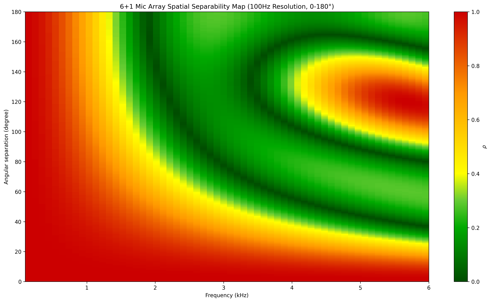

# 6+1 麦克风阵列二维人声方向识别系统

> 当前项目版本：`1.1.1`；Layer 2公开版本：`1.1`。

> **发布状态：项目 `1.1.1`。** L1～L4、Rolling NormMUSIC、永久公共方向ID、并行Runtime、Development Test UI、Pipeline Log UI、RecordingStore、Audio Data Manager与Production UI均已合并。自动化验收通过不替代真实阵列、诊室声场和长时间运行门禁，未完成的实机项目继续明确标注。

> 项目每次具体修改统一记录在[`CHANGELOG.md`](CHANGELOG.md)。任何L1～L4、Development Test UI、Pipeline Log UI、音频录制/数据管理、跨层接口、测试或模型资产变化都必须在提交前同步该日志。

## 项目要解决什么问题
本项目面向诊室环境下的医患对话记录，目标是根据声源的空间方向对音频进行分离和增强，并识别声源为人声的概率。诊室中通常同时存在医生、患者、陪同人员、设备噪声和墙面反射，单支麦克风虽然能够录音，却无法判断某段人声来自哪个方向，也难以将不同讲话人的声音分开。
系统使用一块由6个均匀分布在半径4 cm圆周上的外圈麦克风和1个中央麦克风组成的阵列。根据当前诊室使用目的和阵列物理限制，系统公开至多3个候选讲话方向，而且任意两个方向的水平夹角必须大于或等于45°。系统持续完成以下工作：

1. 采集并校准多通道音频；
2. 判断当前窗口是否存在值得定位的声源；
3. 扫描阵列周围360°，找出最多三个、任意两点至少相隔45°的候选声源方向；
4. 对每个候选方向增强音频；
5. 判断该方向的增强音频是否为人声；
6. 将原始音频、方向、增强音频、模型结果和时间信息按同一时间轴保存。

当前系统输出的是“相对麦克风阵列的水平角方向”和“该方向为人声的概率”，

## 基本模型

诊室内的主要使用目标是区分坐在阵列周围不同方位的人，且人与麦克风阵列的距离远大于麦克风之间的间距。因此，当前版本采用二维远场模型：把到达阵列的声音近似为平面波，只估计水平面内的方位角`theta_deg`。

- `0°`：从麦克风面观察时的正右方，也是MIC0方向；
- `90°`：正上方；
- 角度沿逆时针增加；
- 角度范围为`[0°, 360°)`。

这个模型用一个角度描述声源相对于阵列的位置，不估计距离，也不估计俯仰角。两个处在同一水平角但距离不同的人，在当前模型中不能被可靠区分。

## 重要物理限制：低频声源无法被准确分离

> **这是阵列尺寸决定的物理上限，不是简单调参或增加算力就能解决的问题。** 本阵列孔径较小。低频声音的波长远大于麦克风间距时，同一低频波到达各麦克风的时间差和相位差都很小，不同方向对应的导向矢量会高度相似。系统因此缺少足够的空间信息，无法把来自不同方向的低频内容准确分开。

项目的空间可分度图也反映了这一点：当前`80～1500 Hz`的方向分离效果较差，两个声源的夹角越小越难分离。系统只处理方向夹角大于或等于`45°`的双声源，但即使满足这一条件，低频分离仍不可靠；随着频率升高或两个声源夹角增大，才逐渐出现更多可利用的空间差异。



*图：半径4 cm的6+1阵列空间可分度。横轴为频率，纵轴为两个声源的方向夹角；`rho`越接近1，两个方向的阵列响应越相似，越难进行稳定分离。低频区域在很大的夹角范围内仍保持高相关，体现了小孔径阵列的物理限制。*

这带来几个必须明确的工程边界：

- L2选择2000～4000 Hz做宽带frequency-normalized MUSIC定位，是为了使用相对更有方向信息的频段；代价是对主要能量落在该频段之外、频谱异常或窄带的特殊声源识别与定位能力较差；
- L3虽然在最终音频中保留80～8000 Hz，但当前80～1500 Hz的方向分离效果较差；“保留低频声音”不等于“已经把低频声源分开”；
- 80～500 Hz主要通过DAS保留目标方向的声音和整体听感，不能宣称获得了可靠的双声源低频分离；500～1500 Hz即使使用更复杂BF，仍明显受小孔径限制；
- 1500～2000 Hz属于空间可分能力逐渐改善的过渡频段，实际效果仍取决于声源夹角、阵列朝向和房间混响；
- 当两个人同时讲话时，输出音频的低频部分仍可能包含另一方向的声音、风扇、空调或房间低频噪声；
- 若必须提升低频空间分离能力，需要增大阵列物理孔径、改变麦克风布局、使用多阵列或引入额外先验，而不能只依赖当前BF权重优化。

## 完整架构图

```text
诊室中的医生、患者及环境声音
                        ↓
Sipeed R6+1 + MA-USB8：48 kHz HostAudio [N,8]
    Host通道：CH0..CH5=MIC0..MIC5，CH6=HardwareMix，CH7=Center
                        ↓
Layer 1：输入、通道整理和噪声分析
    解码 → 校准 → 通道重排 → 连续性检查
    LogicalAudio [N,8]：MIC0..MIC5、Center、HardwareMix
        ├── PhysicalAudio [N,7]
        │     六个外圈麦 + Center，参与几何、定位和波束形成
        └── HardwareMix [N]
              只用于接口、显示、录制和后续实验，不进入阵列几何
                        ↓
    【已完成】7麦IMCRA噪声分析
        ├── 每20 ms更新0～8000 Hz噪声PSD、SPP及诊断特征
        └── 每20 ms从500～4000 Hz聚合一次声源概率p20 ∈ [0,1]
                        ↓
    【已完成】可选IMCRA-Wiener预降噪（默认关闭）
        ├── 每个物理麦独立计算增益
        ├── 40 ms窗、20 ms步长、50%重叠相加
        └── 开启时替换下游使用的7路物理音频；原生8ch仍可保存
                        ↓
IngestCoordinator：建立唯一session / epoch / 绝对sample时间轴
                        ↓
WindowAssembler
    【已完成】每20 ms生成一个DecisionWindow [15360,8]
    每个窗口包含最近320 ms音频和16个对齐的IMCRA结果
                        ↓
WindowWorkItem
    冻结该窗口使用的配置
    WindowKey=(session_id, stream_epoch, window_id, decision_sample)
                        ↓ 有界L2 latest-wins队列
Layer 2 1.1：二维声源方向定位
    【已完成】Probability Gate
        ├── 末尾两个20 ms概率取平均，得到40 ms Gate概率
        ├── 默认阈值0.60，可滑动调整
        ├── 低于阈值：不进入srp
                        ↓ Gate开启
    【1.1.1已发布】2000～4000 Hz Rolling NormMUSIC 360°扫描
        ↓ Robust-Z + Sigmoid归一化
        ↓ 圆周局部峰值
        ↓ 最多3个候选方向 CandidateDirection[0..3]，任意两方向夹角≥45°
        ├──输出有声源概率
                        ↓
    【已完成】可选私有方向ID追踪（默认关闭）
        ├── 1.1方向追踪（内部兼容ID：confidence_id_tracker_v2）：NMS前峰池、内部4轨、可信度排序
        ├── 临时ID观察满2秒、自然Gate匹配≥5次且获得L4人声证据后转正
        └── 正式ID具有3秒存活时间，只有后续获得唯一匹配的L4人声可续期，单次续期3s
                        ↓
    【L2 1.1】可选阻尼圆周卡尔曼（默认关闭，依赖ID追踪；V1后端可回退）
        ├── 平滑角度和角速度
        ├── Q/R倍率可在Test UI调节
                        ↓ 输出最多3个候选角度 → 有界L3 latest-wins队列
Layer 3：按候选方向增强音频（BF）
    输入：同一320 ms LogicalAudio + 0～3个候选角度
    当前可用：
        ├── optimized：0/1/2候选策略不变；3候选分别使用Loaded MVDR，失败逐路DAS回退
        └── ds_baseline：7麦Delay-and-Sum；当前只按单声源使用
    实验入口：constant_beamwidth_baseline（固定30° FNBW），当前不作为可用方法
    每个候选输出：48 kHz mono EnhancedAudio [15360]
    物理上限：低频波长远大于阵列孔径，80～1500 Hz方向分离效果差
    当前主要瓶颈：BF计算较慢；虽有缓存部分内容，最近可计算缓存的处理丢窗率为75.78%
                        ↓ 有界L4 latest-wins队列
Layer 4：判断各方向是否为人声
    【已完成】增强音频独立副本 + 16个对齐IMCRA概率
        ↓ imcra_probability_rms_v1响度补偿
          平均响度（RMS）目标-23 dBFS，只放大；最大峰值不超过-3 dBFS
        ↓ 内部从48 kHz降采样到16 kHz
        ↓ NVIDIA预训练Frame VAD Multilingual MarbleNet（直接接入，未微调）
        ↓ 每个方向的Voice / Non-Voice概率和判断
                        ↓
结果汇总与保存
    【已完成】把同一20 ms时刻的方向、增强音频和人声判断重新配对
    【已完成】按采集时间顺序保存，避免跨窗口并行造成结果错位
        ├── 正式录音与算法结果
        │     原始/逻辑/物理音频、IMCRA、空间响应、增强音频和人声判断
        │     60秒切块、异步写盘、异常恢复与保留策略
        └── Development Test UI
              ├── 有序审计快照
              ├── 容量1的L4最新完成帧，仅用于减少显示等待
              └── 本机试听sidecar：Center参考 + Kalman-ready临时/正式方向ID连续音频缓存

跨窗口稳态流水：L2(n) || L3(n-1) || L4(n-2)
同一窗口内部严格执行：L2(n) → L3(n) → L4(n)
所有队列和缓存均有上限；过载窗口产生error记录
当前有效输出帧率偏低，主要受L3 BF吞吐限制，仍待优化
```

上图描述当前1.1.1实现。独立 Pipeline Log UI 位于实时处理平面之外：它与 L1～L4、Development Test UI、录音存储/数据管理系统平行，只读取项目公开接口中的记录并做统计、时间线、单窗详情和逐 ID 回看；它不是 Layer 5，也不控制、消费或反压实时主链。详细边界见[`LOG_UI_ARCHITECTURE_V1.1_TARGET.md`](LOG_UI_ARCHITECTURE_V1.1_TARGET.md)。

## 算法流程说明

### 1. 输入和坐标统一

设备原生输出8通道。Layer 1先把它们整理成统一的逻辑顺序：`MIC0～MIC5、Center、HardwareMix`。前7路具有明确的物理位置，构成实际阵列；HardwareMix没有空间坐标，是阵列自己合成的。不参加MUSIC或波束形成。

整个项目只使用一套麦克风面坐标。几何、定位、波束形成、界面角度和录音manifest必须引用同一坐标，避免出现镜像、顺逆时针相反或固定角度偏移。

### 2. IMCRA噪声分析和可选预降噪

IMCRA是一种递归噪声估计算法。它持续估计每个麦克风、每个频率位置的噪声功率和语音存在概率。

项目各部分选取不同频率区间

- 0～8000 Hz：用于IMCRA噪声统计和可选预降噪；
- 80～8000 Hz：用于Layer 3增强和Layer 4分析；
- 500～4000 Hz：聚合成Layer 2的声源Gate概率；
- 2000～4000 Hz：用于Rolling NormMUSIC方向定位。

可选的IMCRA-Wiener预降噪默认关闭。开启后，每个物理麦克风使用自己的噪声估计计算Wiener增益，再用重叠相加方式连续重建音频。它只改变送往后续算法的7路物理音频，不修改HardwareMix和保存的原生音频。

### 3. 唯一时间轴和滑动窗口

系统为每次采集建立唯一`session_id`，用`stream_epoch`表示连续音频段，并用绝对sample编号描述时间。发生输入丢失或不连续时会切换epoch，防止把不连续音频误拼到同一个算法窗口。

WindowAssembler累计320 ms上下文，之后每20 ms产生一个新窗口。因此算法每秒最多形成50个判断点，但每个判断点都能看到此前完整的320 ms音频。L2、L3、L4使用同一个WindowKey，不能各自重新读取“当前最新音频”。

### 4. Probability Gate

Layer 2先计算窗口末尾两个连续20 ms声源概率的平均值。平均值达到默认阈值`0.60`时才运行MUSIC；低于阈值时跳过定位，减少持续噪声造成的无意义方向结果和计算开销。

Gate阈值与SRP峰值阈值是两个不同参数：前者决定“是否定位”，后者决定“空间响应上的峰是否足够可信”。

### 5. Rolling NormMUSIC二维定位

MUSIC维护多帧STFT的逐频7×7协方差，只使用7个物理麦和2000～4000 Hz频率。每频点执行加载/收缩与Hermitian特征分解，MDL和跨频一致性估计0～3个声源，NormMUSIC式逐频归一化后在0～359°逐度形成伪谱。最后执行45°圆周非极大值抑制，输出0～3个候选方向。

45°是同一窗口内两个候选之间的最小角距。完整360°空间响应会保留供诊断，公共候选只保留角度、分数和时间身份。

当前已知误检是笔记本电脑风扇：当麦克风阵列通过约50 cm连接线放在笔记本电脑附近、现场只有一个主要人声声源时，散热风扇仍可能形成一个稳定候选方向。现有Gate和SRP只能说明某个方向存在符合频带和相位特征的声源，不能仅凭这些结果判断它是不是讲话人。因此，系统进一步通过L4对每个候选方向的增强音频计算人声概率，用于辅助检查和筛选；但由于当前BF方向分离能力较差，尤其在两个声源夹角较小时，另一方向的人声可能串入增强音频，导致L4将其误判为该候选方向的人声。

### 6. 私有方向ID和圆周卡尔曼

方向ID追踪与卡尔曼滤波均为可选功能，默认关闭。ID只用于Layer 2内部把不同窗口中的候选关联起来，卡尔曼则按ID归类角度数据，平滑角度数据，并使用角速度提供预测数据。


### 7. 按方向增强音频

Layer 3对每个候选方向生成一条320 ms、48 kHz单声道增强音频。0/1/2候选完全保持既有BF策略；3候选时三路分别使用IMCRA噪声协方差Loaded MVDR，失败逐路回退DAS。DAS基线当前只按单声源方法使用。界面和代码中还保留固定30°恒定波束宽度实验入口，但它目前不属于可用方法，不能写入正式能力结论。

优化BF会按频率和空间可分度选择处理方式：两个方向导向矢量相关度较低时才适合施加较强的双约束分离；相关度较高时必须转为更保守的MVDR或DAS，避免病态求解和目标失真。尤其在低频段，阵列提供的方向差异不足，算法的目标是稳定保留音频而不是承诺把两个低频声源彻底拆开。

#### 逐频点选择算法

每个频率bin独立选择处理方法。下表中的`rho`是两个候选方向在当前频率上的空间相关度，不是Layer 2输出的声源概率：

| `rho`范围 | 当前算法 | 处理目的 |
|---|---|---|
| `rho < 0.3` | Dual LCMV | 保留目标，同时对另一人形成硬零陷 |
| `0.3 ≤ rho < 0.7` | Soft-null Loaded MVDR | 对另一人进行较柔和的抑制 |
| `rho ≥ 0.7` | Loaded MVDR | 不强行分离，只保持目标方向并抑制噪声 |
| 数值不稳定 | DAS | 单频点安全回退 |

当前实时链路的主要性能瓶颈就在Layer 3 BF。项目已经缓存滚动STFT、IMCRA统计、空间协方差以及可复用的静态计算结果，但优化BF仍然较慢，处理速度跟不上持续输入时会出现较高的窗口丢弃率。现有缓存降低了重复计算量，但尚未解决实时吞吐问题。

### 8. 人声分类

Layer 4判断L3输出的每条方向音频中是否存在人声。它先根据16个20 ms IMCRA概率对模型输入副本做受限响度补偿，再降采样到16 kHz，交给MarbleNet输出Voice / Non-Voice概率。当前CNN采用NVIDIA发布的多语言预训练模型，训练数据包含中文和英文，但英文训练数据来源多于中文；在尚未使用诊室或R6+1目标数据进行微调的情况下，预期英文人声检测表现可能优于中文。

这里的“响度补偿”只是送入CNN前的内部增益调整，不是L2的声源响度测量，也不会输出dB SPL或按方向统计的响度结果。

L4继承并标注L2已经分配的公共方向`track_id`，不向L2回送角度、不创建ID，也不改变方向轨迹生命周期。

### 9. 并行、过载和结果保存

同一个窗口必须依次完成L2、L3、L4；不同窗口可以形成分阶段流水。每层只有一个有状态worker，并使用有界latest-wins等待队列。队列满时只替换尚未开始的旧任务，不取消已经开始的计算。

被丢弃、失败、超时或停机取消的窗口不会静默消失，而会按原时间轴写入明确的终态和ResultWatermark。这样即使实时负载过高，录音和离线分析仍能知道哪些时间点没有得到完整结果。

## Development Test UI使用方法

Development Test UI用于开发、算法观察和实机标定。它与正式处理共用同一个ApplicationRuntime。它目前是主要的交互入口，但不是最终产品界面。

### 1. 环境准备

已验证环境为Windows、Python 3.12、NVIDIA RTX 5060和项目根目录下的`.venv`。建议在VS Code中依次运行以下任务：

1. `环境：创建或更新 RTX 5060 专用环境`
2. `环境：GPU 完整自检`
3. `测试：当前规格全部自动测试`
4. `运行：Development Test UI`

也可以在项目根目录执行：

```powershell
powershell -NoProfile -ExecutionPolicy Bypass -File .\scripts\setup_vscode_env.ps1
.\.venv\Scripts\python.exe .\scripts\check_runtime_env.py --require-cuda
.\.venv\Scripts\python.exe -m pytest -q
.\.venv\Scripts\python.exe -m gui.dev_test_ui.app
```

使用本地测试WAV检查完整链路时，可执行：

```powershell
.\.venv\Scripts\python.exe -m gui.dev_test_ui.app --input-wav "D:\audio\test.wav" --auto-start
```

输入WAV必须是48 kHz、7通道或8通道。7通道离线素材没有原生HardwareMix时由输入适配器按离线契约处理；。

### 2. 推荐操作顺序

1. 连接麦克风阵列和电源，确认Windows已识别MA-USB8设备。
2. 启动Test UI，先观察全局状态栏是否有设备、CUDA或模型错误。
3. 点击左上角“启动采集”。首次形成正式窗口前需要累计320 ms音频，IMCRA也会显示预热状态。
4. 检查8路电平是否都有响应，通道名称和实际敲击位置是否一致。
5. 需要保存完整实验数据时点击“正式录音开始”；只想临时试听或留一小段测试素材时使用“录制/暂停/结束”scratch录音。
6. 在右上角观察Gate、360°空间响应和候选角度，再根据测试目的切换ID追踪、卡尔曼或L3对照模式。
7. 在左下角试听Center参考和已进入卡尔曼持续跟踪的临时/正式方向音频，在右下角观察CNN人声概率。
8. 结束实验时先点击“正式录音暂停”，并结束仍在进行的scratch录音；再点击“停止采集”，等待流水线排空后关闭窗口。

### 3. 四象限分别表示什么

#### 左上：Layer 1输入与录音

- 显示`MIC0～MIC5、Center、HardwareMix`共8路电平和削波状态；
- 显示IMCRA预热、噪声摘要和预降噪平均增益；
- “IMCRA预降噪”可在采集中切换，修改从后续完整窗口生效；
- “灯光开/灯光关”用于检查板卡控制链；
- scratch录音位于`data/dev_test_ui/scratch/current`，用于临时测试；
- 正式录音位于`data/runtime_sessions/YYYY/MM/<session_id>`，包含正式时间轴和算法sidecar。

#### 右上：Layer 2方向定位

- 圆环蓝线是当前窗口完整360°原始MUSIC伪谱；
- 候选点使用L2最终平滑角，因此可能与原始峰顶略有偏移；
- 临时候选显示为灰色；正式ID使用红/绿交替颜色；
- 大点表示当前窗口有真实观测，小点表示卡尔曼预测；
- “L2声源Gate”阈值决定是否执行定位，默认0.60；
- SRP候选阈值决定空间峰是否进入候选；
- “迭代多峰”是实验性多声源搜索开关；
- 私有方向ID追踪可独立开启；圆周卡尔曼依赖ID追踪；
- Q倍率控制过程噪声，R倍率控制测量噪声。调整后点击应用，从下一完整窗口生效。

当前默认卡尔曼参数调得偏保守，主要用于降低静止或缓慢移动声源的角度抖动。声源角速度较高时，滤波结果可能滞后于真实方向。

如果显示`WARMING_UP`或`UNAVAILABLE`，表示概率尚未准备好、输入不连续或必要数据缺失。

#### 左下：Layer 3方向增强与试听

- 第一行是预降噪前Center麦克风原音参考；
- 方向轨在L2临时ID建立卡尔曼状态后开始缓存，转正式时沿用同一缓存；
- 候选消失后等待3秒再结束对应方向轨；
- 可通过按键切换bf模型，当前可用的是`optimized`和`ds_baseline`：优化方法支持最多3个候选方向，DAS基线只用于单声源；
- `constant_beamwidth_baseline`保留在切换入口中，但当前不可作为正式可用方法；
- 切换L3模式会清空旧模式的方向试听缓存；

#### 右下：Layer 4人声判断

- 显示每个候选方向的CNN人声概率和Voice / Non-Voice结果；
- L4阈值只重新判断缓存的CNN概率，不改变L2 Gate；
- 界面优先显示最近一个真正完成的完整L2/L3/L4同窗帧；


### 4. 参数调整建议

初次实机测试应保持默认配置，只改变一个参数并记录前后结果：

1. 先关闭预降噪、ID追踪、卡尔曼和迭代多峰，检查基础Gate与SRP方向；
2. 再开启ID追踪，观察候选能否稳定关联并满足3秒转正确认；
3. 最后开启卡尔曼，分别小幅调整Q/R倍率比较静止抖动和移动跟随；
4. 使用同一段单人医患语音比较优化方法和DAS；双声源只使用优化方法。恒定波束宽度入口暂不纳入有效对比；
5. Gate阈值、SRP候选阈值和L4分类阈值分别记录，不要把三者当成同一个“灵敏度”。

## 录音数据和配置

唯一业务配置是[`config/config.yaml`](config/config.yaml)。运行时队列容量、算法开关、模型、Test UI和录音保留策略都由严格schema检查，非法值会在启动前失败。

正式录音默认按60秒切块，可保存：

- 原生8通道、逻辑8通道和物理7通道音频；
- IMCRA噪声与概率sidecar；
- 360°空间响应和候选方向；
- Layer 3增强音频；
- Layer 4概率、阶段状态、耗时和错误原因；
- DecisionRecord、ResultWatermark、manifest和配置hash。

配置中的`privacy.local_only=true`、`automatic_upload=false`表示项目默认只在本机保存且不自动上传。但这只是软件默认行为，不等同于完成医疗数据合规。诊室采集前仍需要取得授权、限制访问权限、制定保留和删除策略，并根据所在地区要求进行去标识化和审计。

## Pipeline Log UI（1.1.1已实现）

项目已提供独立只读的 Pipeline Log UI，用于查看单次运行记录中的阶段性能、终态、MUSIC/方向 ID、L3增强资产、L4结果、丢窗和时间线。其项目地位与 L1～L4、Development Test UI、RecordingStore/Audio Data Manager 平行，不属于算法流水线的下一层。

当前版本优先完整回看已完成、已封存的 session；若由同一正式进程显式提供 Runtime 引用，只额外展示公开的聚合运行状态。Log UI 不消费 Development Test UI 的 latest-only 邮箱，也不直接打开私有运行时数据绕过公共查询边界。

Log UI 只能统计、展示和回放，不得启动/停止 Runtime、修改算法参数、标注/导出/删除数据、重建 Catalog，或在项目数据目录写缓存。公开接口未提供的数据明确显示 `N/A`。页面、数据覆盖、统计口径、兼容性和只读验收详见[`Log UI 1.1架构`](LOG_UI_ARCHITECTURE_V1.1_TARGET.md)。

## 当前完成情况

以下主链已经接通并有自动化测试覆盖：

- L1多通道输入、IMCRA和可切换预降噪；
- 唯一时间轴与320 ms/20 ms窗口装配；
- L2 Probability Gate、Rolling NormMUSIC、永久公共方向ID和可选Kalman；
- L3优化BF和单声源DAS基线；恒定波束宽度仅保留实验入口，尚未列为可用能力；
- L4响度补偿、MarbleNet适配和人声结果；
- 有界L2/L3/L4跨窗口流水、ResultJoiner和有序提交；
- Development Test UI、正式录音、scratch录音和Audio Data Manager基础能力。

“代码已接通”不代表已经完成诊室部署验收。下列实机与目标域门禁仍需完成。

当前实测还存在较高的处理丢窗率和偏低的有效输出帧率。这里主要指算法处理队列中的window/frame drop，不是已经确认的USB输入数据包丢失。主要卡点是Layer 3 BF计算较慢；现有缓存优化只能部分缓解，尚不能保证持续输入下稳定达到目标刷新率。

最近一份可计算的正式缓存来自2026-08-18 14:30，session为`ea30a66d-9d4b-44c5-bb52-e106c85e05ed`，记录了15.36秒、768个20 ms窗口。统计结果如下：

| 项目 | 数量/结果 | 占全部窗口 |
|---|---:|---:|
| 完整输出 | 186 | 24.22% |
| 任一处理阶段丢窗 | 582 | 75.78% |
| L3入队溢出 | 581 | 75.65% |
| L4入队溢出 | 1 | 0.13% |
| L2完成 | 768 | 100% |

这段缓存的完整结果有效输出率约为`12.11帧/秒`。187个实际执行完成的L3窗口中，BF计算耗时平均`81.3 ms`、P50为`79 ms`、P95为`125 ms`，明显大于每20 ms到达一个新窗口的输入速度。对应manifest中`missing_intervals=[]`，说明录制区间音频连续；75.78%主要是算法处理队列丢窗，而不是已确认的USB采集缺口。

需要注意，这份缓存使用`circular_id_tracker_v3`，早于当前v4实现。之后生成的v4 session目录目前只有manifest，没有正式DecisionRecord，因此尚不能从现有文件计算v4的真实丢窗率。README中的75.78%只能作为最近一次有完整证据的性能基线，不能冒充当前v4最终结果。

## 局限性和待解决问题

### 1. 低频空间分离受阵列孔径限制

- 低频波长远大于麦克风间距，不同方向在阵列上的相位和时延特征过于接近；
- 空间可分度`rho`在低频区域接近1，代表方向响应高度相关，双声源约束难以稳定建立；
- L3保留80～8000 Hz是为了保留人声频段内尽可能多的信息；当前80～1500 Hz无法分离；
- 低频串音、风扇和空调残留是当前架构可以预期的结果，不能通过提高卡尔曼精度或CNN阈值解决；
- 真正改善低频分离通常需要更大的阵列孔径或新的硬件布局，因此属于后续硬件方案问题。

### 2. 二维远场假设的限制

- 不估计距离、俯仰角或声源高度；
- 同一水平角上的近远两个声源无法区分；
- 近场说话、人在阵列正上方、明显高度差或快速移动可能破坏平面波假设；
- 墙面、桌面、玻璃和医疗设备造成的强反射可能产生错误峰或角度偏移。

### 3. 多人和角度分辨能力有限

- 当前每个窗口最多输出两个候选方向；
- 两个候选必须至少相距45°；
- 当前方向结果不包含物理响度、声压级或角度不确定度；
- 2000～4000 Hz内持续存在的非人声声源也可能形成稳定候选，例如靠近阵列的笔记本电脑散热风扇；
- 当前无法可靠处理3人及以上同时说话、方向过近或说话人交叉移动的情况
- 私有方向ID只表示短时方向轨迹，不表示人物身份，不能据此判断谁是医生或患者。

### 4. 实机几何和动态参数尚未完全标定

- 硬件通道、极性、固定延迟和真实角度仍需校准；
- SRP阈值、Gate阈值、ID关联门限、卡尔曼Q/R和3秒寿命需要用真实诊室数据标定；
- 当前卡尔曼Q/R设置偏保守，只适合静止或低角速度声源；快速移动时可能产生明显跟踪滞后；
- 仍需覆盖静止、移动、交叉、混响、双声源和不同座位布局；
- 麦克风或设备型号变化后不能直接沿用原参数。

### 5. 人声模型仍需诊室目标域验证

- 当前MarbleNet是NVIDIA预训练模型的直接接入版本，没有进行项目数据微调；
- 模型同时使用中文和英文训练数据，但英文数据来源更多，预期英文人声检测表现可能优于中文；官方未公布中英文直接对比准确率，仍需用诊室中文对话实测；

### 6. 实时性和稳定性门禁尚未完成

- 现有CUDA逐阶段基准不等于端到端延迟；
- 当前丢窗率较高，主要瓶颈是Layer 3 BF计算；滚动STFT、IMCRA统计、协方差和静态结果缓存不足以消除该瓶颈；
- 当前有效输出帧率偏低，需要继续优化BF计算、GPU利用、队列等待和结果投影开销；
- 仍需测试采集、GPU计算、队列等待、有序提交、录音写盘和UI共同运行时的实际延迟；
- CUDA OOM、CPU fallback、设备断连和持续过载需要实机故障注入；


### 7. 产品化和临床使用尚未完成

- Development Test UI面向开发者，控件和诊断信息不适合直接交给诊室工作人员；
- 正式`app.main`入口、最终用户方向界面和完整实机UI门禁仍未完成；


## 进一步阅读

- [总执行规格](CODEX_PROJECT_SPEC_6plus1_2D_voice_direction_v0.2.md)
- [v0.3目标架构与迁移契约](ARCHITECTURE_V0.3_TARGET.md)
- [1.1.1 MUSIC、公共方向ID与平行子系统架构](ARCHITECTURE_V1.1_TARGET.md)
- [Pipeline Log UI 1.1架构](LOG_UI_ARCHITECTURE_V1.1_TARGET.md)
- [Windows与RTX 5060环境说明](ENVIRONMENT.md)
- [Layer 1说明](layer1_input/README.md)
- [Layer 2说明](layer2_source_detection/README.md)
- [Layer 3说明](layer3_direction_signal/README.md)
- [Layer 4说明](layer4_voice_classifier/README.md)
- [ApplicationRuntime说明](app/README.md)
- [Development Test UI说明](gui/dev_test_ui/README.md)
- [Audio Data Manager说明](data_management/README.md)
