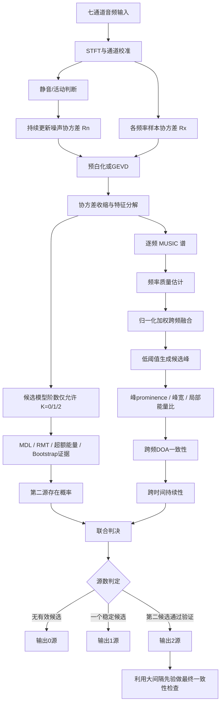

# 面向低源数安静声场的 MUSIC 伪峰与旁瓣双层抑制研究报告

## 执行摘要

本报告针对一个非常明确、也非常有利于“做强先验约束”的应用场景：**较安静环境、同时存在 0–2 个声源、双声源夹角不小于 50°，阵列为中心麦克风加六阵元圆环的 6+1 平面阵列，给定麦克风间距 4 cm**。下文按“外环相邻阵元中心距为 4 cm”理解；对于正六边形外环，这意味着外环半径约为 **4 cm**，阵列最大孔径约为 **8 cm**。目标不是单纯追求 MUSIC 谱更尖，而是在**尽量保持检测灵敏度、不漏掉弱声源的前提下，显著减少多报出来的伪峰、旁瓣和虚假第二声源**。

核心结论是：**这个问题不应只在 MUSIC 谱输出端做峰值阈值，而应同时修改“进入 MUSIC 的协方差与子空间”和“MUSIC 输出后的判决逻辑”**。经典 MUSIC 利用导向矢量与噪声子空间的正交性形成高分辨率伪谱；其性能高度依赖正确的信号子空间维数、准确的阵列流形以及近似白噪声假设。模型阶数过估时，噪声特征向量会被错误划入信号子空间，噪声子空间维度被压缩，很容易产生额外局部极大值；模型阶数低估则可能把真实声源分量留在噪声子空间中，从而造成漏检。Schmidt 的 MUSIC 原始工作建立了这一特征子空间框架，后续 MUSIC 性能研究进一步表明其精度与分辨能力会受 SNR、有限快拍以及模型误差显著影响。citeturn0search0turn8search3turn11search3

对于本场景，**最重要的先验其实不是某个更复杂的 DOA 算法，而是“声源数绝不会超过 2”**。因此不建议让 MDL、AIC 或“95%累计能量”在 \(0,\ldots,6\) 范围自由选择阶数；应把模型选择直接约束为

\[
K\in\{0,1,2\}.
\]

这会从源头切断大量因过估阶数而出现的伪峰，而且不会损伤题设中合法场景的检测能力。

尤其需要警惕目前常见的 **95% 特征值累计能量阈值**。它并不是一个适合本问题的声源计数准则。对于 7 阵元、单源、理想白噪声模型，即便阵列和协方差完全正确，只要噪声存在，噪声的 6 个特征值本身也贡献总能量。因此低至中等 SNR 下，达到 95% 累计能量通常必须把多个噪声特征值也算进去。例如按理想单源模型推导，0 dB 时可能需要累计 **7 个**特征值才能达到 95%，10 dB 时仍可能需要约 **4 个**；只有单源每阵元 SNR 大约超过 **12 dB** 后，第一特征值才可能单独超过总特征值能量的 95%。因此，直接把“达到 95% 总能量所需特征值数”当成声源数，在本系统里天然倾向于严重高估。这个结论来自本报告基于 7 阵元协方差模型的直接推导，而非 MUSIC 本身的性质。

MDL 要区别看待。经典 Wax–Kailath MDL 在理想白噪声、大样本条件下具有一致性，而 AIC 在渐近意义下存在过估倾向；**经典 MDL 在纯粹“低 SNR”条件下反而常表现为漏掉弱源，而不是必然偏高**。citeturn0search1 如果实际系统发现 MDL 经常输出过高阶数，首要怀疑应是：空间有色或各通道不等强噪声、麦克风幅相不一致、有限样本导致噪声特征值扩散、混响和反射造成协方差秩膨胀、把多个频率错误地视为独立声源维度，或者阵列流形失配。Fishler 与 Poor 明确指出标准 MDL 对非白噪声、非理想点源等空间模型偏离并不稳健。citeturn2search1

本阵列的另一个关键限制来自空间采样。假设声速 \(c=343\ {\rm m/s}\)，最近邻距离 \(d=0.04\ {\rm m}\)，经典半波长条件给出

\[
f_{\rm alias}\approx\frac{c}{2d}
=\frac{343}{0.08}
\approx 4288\ {\rm Hz}.
\]

六阵元外环从圆阵相位模态角度得到的可用上限也约为

\[
kr\lesssim 3
\quad\Rightarrow\quad
f\lesssim \frac{3c}{2\pi r}
\approx 4.09\ {\rm kHz},
\]

这与 4.29 kHz 的最近邻半波长条件高度一致。UCA 的相位模态方法和有限圆周空间采样正是圆阵高分辨 DOA 方法的重要基础。citeturn4search15 因此本系统应把 **约 4.0–4.1 kHz 视为稳健定位上界，而不是因为采样率达到 16/48 kHz 就继续使用 6–8 kHz 甚至更高频率**。

另一方面，8 cm 孔径在低频的空间相位差非常小。按传统孔径半功率角宽的量级估计，

\[
\Delta\theta_{\rm ap}
\approx 0.886\frac{\lambda}{D},
\]

在 4 kHz 时仍约为 54°；经典波束形成甚至刚刚接近题设的 50°双源间距。**MUSIC 的价值正是在足够 SNR、正确阶数和良好阵列模型下突破这一传统主瓣宽度尺度进行“超分辨”**，但这也意味着 50°双源分辨应该主要依赖 **3–4 kHz** 的高空间信息频率，而 500 Hz–1 kHz 不宜成为双源判决的主要证据。MUSIC 相对于传统波束形成的高分辨特性及其统计性能在经典工作中已有系统分析。citeturn8search3turn8search11

因此，本报告建议的最终结构是：

**噪声白化 / 稳健协方差 → 受限的 \(K=0,1,2\) 模型阶数估计 → 分频 MUSIC → 频率质量加权与跨频一致性融合 → 高灵敏度候选峰生成 → 利用 0–2 源和 ≥50°先验进行非对称二次验证 → 时间持续性确认。**

其中优先级最高的工程改动是：

1. **停止直接使用 95%“总特征值能量”决定声源数**；若仍使用能量方法，应改为扣除噪声底后的“超额特征值能量”。
2. **所有模型阶数估计限制在 \(0,1,2\)**。
3. 安静环境中积极利用无声段估计 \(R_n(f)\)，实施预白化或 GEVD-MUSIC；GEVD-MUSIC 已被用于提高小型机器人麦克风阵列在噪声中的定位鲁棒性。citeturn6search10
4. 定位频带初始采用 **1–4 kHz**，真正决定双源分辨的高权重区采用约 **2.5–4.0 kHz**；不要让 \(>4.1\) kHz 的混叠频率主导结果。
5. 第一声源使用低阈值保持召回率；**第二声源必须通过跨频/跨时间一致性验证**，而不是仅因为一帧 MUSIC 中出现第二高峰就上报。
6. 在最终谱上，不采用简单“峰高超过固定阈值”，而使用 **峰 prominence + 局部能量比 + 跨频支持率 + 时间持续度 + 与第一峰间距** 的联合置信度。
7. 如果仍有严重伪峰，再把多快拍 SBL 或 \(\ell_1\) 稀疏重构作为第二阶段验证器，而非第一时间彻底替换 MUSIC。稀疏 DOA 和 SBL 的研究表明它们能够显式利用角域稀疏性形成较尖锐的空间谱，但代价是更高计算量、网格误差或迭代收敛问题。citeturn1search2turn8search2


## 问题建模与 MUSIC 机理

对于某一窄带频率 \(f\)，7 通道阵列接收向量可以写为

\[
\mathbf x_f(t)
=
\mathbf A_f(\boldsymbol\theta)\mathbf s_f(t)
+\mathbf n_f(t),
\]

其中

\[
\mathbf A_f=
[\mathbf a_f(\theta_1),\ldots,\mathbf a_f(\theta_K)]
\]

是阵列导向矩阵。远场平面波条件下，第 \(m\) 个麦克风的导向项可写成

\[
a_m(f,\theta)
=
\exp
\left[
-j\frac{2\pi f}{c}
\mathbf r_m^\mathsf T
\mathbf u(\theta)
\right].
\]

对于平面圆阵，只做水平面方位角时可取

\[
\mathbf u(\theta)
=
[\cos\theta,\sin\theta]^\mathsf T.
\]

样本空间协方差为

\[
\hat{\mathbf R}_x(f)
=
\frac{1}{N}
\sum_{n=1}^{N}
\mathbf x_f(n)\mathbf x_f^H(n).
\]

理想空间白噪声条件下，

\[
\mathbf R_x
=
\mathbf A\mathbf R_s\mathbf A^H
+\sigma_n^2\mathbf I.
\]

若有 \(K\) 个独立、可辨识声源，对协方差进行特征分解：

\[
\mathbf R_x
=
\mathbf E_s\mathbf\Lambda_s\mathbf E_s^H
+
\mathbf E_n\mathbf\Lambda_n\mathbf E_n^H,
\]

其中 \(\mathbf E_s\) 是 \(K\) 维信号子空间，\(\mathbf E_n\) 是 \(M-K\) 维噪声子空间。MUSIC 的关键事实是：真实方向的导向矢量与噪声子空间正交，因此构造

\[
P_{\rm MUSIC}(f,\theta)
=
\frac{1}{
\mathbf a_f^H(\theta)
\mathbf E_n(f)\mathbf E_n^H(f)
\mathbf a_f(\theta)
}.
\]

真实 DOA 附近分母趋小，从而形成峰。Schmidt 的经典论文正是围绕这一噪声子空间正交结构建立 MUSIC。citeturn0search0

对于宽带声学信号，单个 MUSIC 不能直接把整个语音/噪声频带当成一个窄带源处理。典型解决方式有两类：一类是**非相干宽带 MUSIC**，逐频率求谱再融合；另一类是把不同频带的信号子空间通过 focusing 变换映射到统一参考频率后形成 coherent signal-subspace。Wang 和 Kaveh 的经典 CSSM 工作就是后者的代表。citeturn1search1turn1search9 对本项目而言，由于只有 0–2 源且要求工程稳健，优先推荐较简单的“逐频 MUSIC + 归一化加权融合”，除非实验证明宽带相干聚焦带来明显收益。

这里最重要的数学关系是**阶数估计与伪峰直接耦合**：

\[
\hat K > K
\quad\Longrightarrow\quad
\dim(\hat E_n)=M-\hat K
\text{ 过小},
\]

于是部分本应属于噪声的特征向量被划进“信号子空间”。MUSIC 分母不再由完整噪声空间约束，原本只是有限阵列相关性的局部低谷可能变成明显峰值。对于只有一个真实声源的场景，这正是“算法自己制造第二方向”的典型通路。

反过来，

\[
\hat K<K
\]

会使一个真实信号方向的部分能量残留在噪声子空间中，因此真正的 MUSIC 峰变矮、变宽甚至消失。对于“误报优先压制但不能漏报”的项目，不能简单通过把所有阈值提高来解决问题，而必须把**阶数可靠性**和**第二峰真实性验证**分开处理。

还应强调，MUSIC 谱中的“旁瓣”与传统 Delay-and-Sum 波束图的旁瓣并不完全相同。MUSIC 是伪谱而非物理波束功率；其副峰来源包括阵列流形之间的有限相关性、有限快拍导致的子空间扰动、错误阶数以及模型失配。阵列位置、增益、相位等模型误差会显著影响子空间 DOA 算法，这也是 MUSIC 高分辨能力付出的鲁棒性代价。Swindlehurst 与 Kailath 对存在模型误差时的 MUSIC 性能进行了专门分析。citeturn11search0turn11search3


## 伪峰、旁瓣与信号子空间维数偏差

在该系统中，建议把伪峰来源分为五类。这样做的意义在于：**不同伪峰不能用同一个峰值阈值解决。**

第一类是**模型阶数伪峰**。这是目前最值得优先排查的类型。如果真实 \(K=1\)，但 MDL、95% 能量法或其他算法输出 \(\hat K=2,3,\ldots\)，MUSIC 会主动缩小噪声子空间，并有很大概率把随机扰动或阵列流形相关性变成额外谱峰。

第二类是**有限快拍伪峰**。实际使用的是

\[
\hat R_x\neq R_x.
\]

有限 \(N\) 会造成理论上应相同的噪声特征值发生散布，信号/噪声特征向量也产生扰动。当 \(N\) 很少或 SNR 下降时，这种扰动更严重。随机矩阵研究表明，在“阵元数相对于样本数不可忽略”的情况下，样本特征值和真实协方差特征值之间存在系统性的有限样本行为，并存在弱信号不可分辨的相变区域。citeturn0search30turn8search1

第三类是**噪声有色或通道不均匀引起的伪信号维数**。标准 MDL 和 MUSIC 常假设噪声协方差近似为

\[
R_n=\sigma^2I,
\]

也就是说所有噪声特征值理论上相等。如果某些麦克风自噪声较强、ADC 增益不同、机械噪声通过某些通道耦合，或者环境噪声具有空间相关性，则会出现

\[
R_n\neq\sigma^2I.
\]

此时“噪声特征值簇”会自然分裂，MDL 很容易把最大的几个噪声模态解释为信号。标准信息准则对这种模型偏离并不稳健，已有 robust-MDL 工作专门解决不等噪声水平的情况。citeturn2search1 这也是为什么本项目在**安静环境反而特别适合做噪声协方差建模**：没有声源的时间段很多，可以持续更新 \(R_n(f)\)。

第四类是**阵列流形失配**。如果麦克风真实坐标与程序中的坐标差 1–2 mm、通道有相位延迟、不同麦克风频响不一致、声速设置不正确，或者近场声源仍采用平面波 steering vector，都会破坏

\[
a^H(\theta_{\rm true})E_n\approx0.
\]

MUSIC 对这类模型误差的敏感性已有经典理论分析。citeturn11search3 因此，在继续堆叠复杂峰值规则之前，实际硬件最好先进行一次**幅相与几何校准**。

第五类是**宽带和混响效应**。一个真实声源通过墙面或桌面反射可在不同频率形成不同的有效到达结构，导致单源协方差不再严格表现为简单秩一模型；两个声源高度相关时也会导致信号协方差秩下降。空间平滑最初就是为解决相干源导致的子空间退化而提出。citeturn7search0

### MDL、AIC 与能量阈值在本场景中的行为

Wax–Kailath 经典准则对候选阶数 \(k\) 使用剩余 \(M-k\) 个特征值的几何平均值 \(g_k\) 与算术平均值 \(a_k\)。典型 MDL 形式为

\[
{\rm MDL}(k)=
-N(M-k)
\ln\frac{g_k}{a_k}
+
\frac12 k(2M-k)\ln N,
\]

选择使其最小的 \(k\)。当剩余特征值全是理想白噪声时，

\[
g_k/a_k\rightarrow1,
\]

因此继续增大 \(k\) 带来的似然收益很小，而惩罚项抑制过拟合。Wax 和 Kailath 证明了经典 MDL 的一致性，同时指出 AIC 渐近上存在过估概率。citeturn0search1

因此，对“为什么我的 MDL 偏高”应给出一个非常明确的判断：

> **如果实际 MDL 长期偏高，不能简单归因于低 SNR。纯低 SNR 往往更容易把弱信号压进噪声特征值簇，从而使 MDL低估；持续过估通常意味着 MDL 的噪声或模型假设被破坏。**

有色噪声就是最典型情形。此时即使没有声源，

\[
\lambda_1^{(n)}
>
\lambda_2^{(n)}
>
\cdots
>
\lambda_M^{(n)},
\]

\(g_k/a_k\) 也明显小于 1。每去掉一个较大的“噪声特征值”，剩余特征值会变得更接近，于是似然项错误地奖励较大的 \(k\)，直到惩罚项才能阻止它。这正是 MDL 产生虚假源数的机制之一，robust-MDL 文献明确指出传统 MDL 对不均匀噪声条件缺乏鲁棒性。citeturn2search1

相比之下，**95%总能量阈值在本场景甚至存在结构性错误**。取 \(M=7\)，理想单源，令每阵元信号噪声功率比为 \(\rho\)，并假设

\[
\|a\|^2=M.
\]

协方差特征值近似为

\[
\lambda_1=\sigma_n^2(1+7\rho),
\]

以及

\[
\lambda_2=\cdots=\lambda_7=\sigma_n^2.
\]

第一特征值占总特征值和的比例为

\[
\eta_1=
\frac{1+7\rho}
{7(1+\rho)}.
\]

由此可直接得到：

- \(-10\) dB，即 \(\rho=0.1\)：第一模态仅约占 **22%**；
- \(0\) dB：约 **57%**；
- \(10\) dB：约 **92%**；
- 只有约 \(12.1\) dB 以上才接近 95%。

而在**无声源**情况下，7 个理想噪声特征值完全相等，要累计 95% 总能量实际上必须取几乎全部特征值。因此，“95%累计能量 = 信号子空间维数”不但不能可靠检测 0 源，反而会天然把噪声当作高阶信号。

如果希望保留能量思路，应改成先估计噪声底

\[
\hat\sigma_n^2
=
{\rm median/mean}
\{\lambda_i\}_{i\in noise},
\]

再使用

\[
e_i=
\max(\lambda_i-\hat\sigma_n^2,0)
\]

作为**超额信号能量**，对

\[
\frac{\sum_{i=1}^{k}e_i}
{\sum_i e_i}
\]

做自适应阈值，而不是对原始 \(\lambda_i\) 做 95%。

对于本项目，维数判决最好采用**多证据融合**：

\[
\hat K\in\{0,1,2\},
\]

其中 RMT/MDL/超额特征值仅负责给出“第二个信号模态是否可信”，最终还必须由 MUSIC 的空间方向一致性进行验证。随机矩阵方法利用噪声最大特征值的统计分布进行逐个信号检测，在低样本条件下可优于经典 MDL，但 RMT 本身也存在弱信号可检测极限。citeturn0search30turn8search1

对于白噪声的粗略 RMT 判定，可以使用 Marchenko–Pastur 噪声谱上缘尺度

\[
\lambda_+
\approx
\hat\sigma^2
\left(1+\sqrt{\frac{M}{N}}\right)^2,
\]

再通过 Tracy–Widom 修正或 Bootstrap 确定假警率。Kritchman–Nadler 正是将随机矩阵理论与序贯假设检验结合用于源数检测。citeturn8search1 但由于本阵列只有 \(M=7\)，不属于典型“大维数”极限，建议把 RMT 阈值作为**候选证据**，并在真实数据上用 Bootstrap 标定，而不是照搬渐近阈值。

Bootstrap 对本问题尤其有吸引力，因为它可以直接估计有限快拍下特征值或子空间指标的波动范围。已有源数估计研究表明 Bootstrap 在小快拍、低 SNR 情况下可改善源数检测。citeturn9search0 计算量允许时，可对每 0.5–1 s 的窗口做 50–200 次重采样；实时资源有限时，则可只在线更新较慢的源数置信区间，而不是每个 STFT 帧都 Bootstrap。

还可加入 EEF 等有限样本信息准则作为对照。Xu 和 Kay 的 EEF 源数估计工作报告了其在低 SNR、小快拍以及近间隔声源条件下相较传统信息准则的改进。citeturn9search4 对本项目更实用的做法不是选定某一个准则“统治全部情况”，而是把 \(K=2\) 定义为需要**多个独立证据支持的事件**。


## 阵列频段与空间采样

按外环相邻距离 \(d=4\) cm，则规则六边形的外接圆半径也是

\[
r=4\ {\rm cm},
\]

最大外环对径为

\[
D=8\ {\rm cm}.
\]

中心麦克风增加了一个空间观测通道，有利于协方差估计、稳健性和低阶模态信息，但**不增加最大孔径**；真正决定最大基线的是两个相对的外环麦克风。

采用 \(c=343\ {\rm m/s}\)。最近邻满足半波长空间采样的上限为

\[
d\le \frac{\lambda}{2}
\Rightarrow
f\le 4.2875\ {\rm kHz}.
\]

另一方面，六元 UCA 的角向空间模态数有限。UCA 高分辨算法通常通过相位模态把圆阵转换到 beamspace；有限阵元数会限制能够无混叠表示的圆周空间模态。Mathews 与 Zoltowski 的 UCA MUSIC/ESPRIT 工作系统使用了这种 phase-mode 架构。citeturn4search15 对六个均匀圆周样本，可近似认为无混叠模态为 \(|m|\le3\)，而声场中显著的圆阵模态阶数随 \(kr\) 增加，因此 \(kr\lesssim3\) 给出约 **4.09 kHz** 的保守上限。

下表中的“理论角分辨尺度”不是 MUSIC 的硬分辨极限，而是用传统孔径的近似半功率主瓣宽

\[
\Delta\theta_{\rm ap}
\approx
0.886\frac{\lambda}{D}
\]

计算的**物理孔径尺度**。MUSIC 在理想高 SNR 和准确模型下可以实现比它更小的双源间隔分辨，因此表格应理解为“该频率给阵列提供多少天然角向信息”，而不是断言 MUSIC 无法超过它。MUSIC 的超分辨统计性能已经被经典工作系统研究。citeturn8search3turn8search11

| 频率 | 波长 \(\lambda=c/f\) | 阵列最大孔径 | \(d/\lambda\) | 孔径角分辨尺度约值 | 空间混叠风险 | 对本系统的建议 |
|---:|---:|---:|---:|---:|---|---|
| 500 Hz | 68.6 cm | 8 cm | 0.058 | \(>180^\circ\) | 极低 | 主要用于活动检测，不适合作双源角分辨 |
| 1 kHz | 34.3 cm | 8 cm | 0.117 | \(>180^\circ\) | 极低 | DOA 信息弱，可低权重融合 |
| 1.5 kHz | 22.9 cm | 8 cm | 0.175 | \(\approx145^\circ\) | 极低 | 可稳定单源方向，但双源分辨有限 |
| 2 kHz | 17.15 cm | 8 cm | 0.233 | \(\approx109^\circ\) | 低 | 开始具有有用相位孔径 |
| 2.5 kHz | 13.72 cm | 8 cm | 0.292 | \(\approx87^\circ\) | 低 | 推荐进入主定位频带 |
| 3 kHz | 11.43 cm | 8 cm | 0.350 | \(\approx72.6^\circ\) | 低 | 双源 MUSIC 的重要频率 |
| 3.5 kHz | 9.80 cm | 8 cm | 0.408 | \(\approx62.2^\circ\) | 中低 | 很有价值，应较高权重 |
| 4 kHz | 8.58 cm | 8 cm | 0.466 | \(\approx54.4^\circ\) | 接近上限 | 对 ≥50° 双源最关键频段之一 |
| 4.1 kHz | 8.37 cm | 8 cm | 0.478 | \(\approx53.1^\circ\) | UCA 模态边缘 | 建议作为稳健上界附近 |
| 4.288 kHz | 8.00 cm | 8 cm | 0.500 | \(\approx50.8^\circ\) | 半波长极限 | 不建议作为长期主要工作点 |
| 5 kHz | 6.86 cm | 8 cm | 0.583 | \(\approx43.5^\circ\) | 明显 | 可能出现空间别名伪峰，应剔除或强降权 |
| 6 kHz | 5.72 cm | 8 cm | 0.700 | \(\approx36.3^\circ\) | 高 | 不应参与常规 DOA 判决 |

这个表暴露了一个很重要的设计矛盾：**若严格避免空间混叠，传统 8 cm 孔径的主瓣尺度几乎无法自然小于 50°**。也就是说，题设中“两源至少相距 50°”恰好位于这套小阵列的高频边界附近。真正实现稳定双源分辨必须同时依赖：

\[
\text{高频空间信息}
+
\text{MUSIC 超分辨}
+
\text{正确模型阶数}
+
\text{跨频统计增益}.
\]

因此，对于采样率：

**8 kHz 采样率**的 Nyquist 上限只有 4 kHz，虽然恰好落在空间混叠边界以下，但抗混叠模拟/数字滤波器通常需要过渡带，因此真正可靠的最高频率可能只有约 3.5–3.8 kHz。这样会削弱最有利于 50°双源分辨的频率成分。

**16 kHz 是本项目最值得推荐的定位采样率。** Nyquist 为 8 kHz，但算法只使用大约 1–4 kHz，不受数字 Nyquist 上限挤压，同时有充足的抗混叠过渡余量。

**44.1/48 kHz** 并不会因为采样率更高而让 4 cm 阵元间距在 8–15 kHz 仍保持无空间混叠；硬件如果必须运行 48 kHz，可以保留原始音频，然后为 DOA 路径低通到约 4 kHz 并降采样到 12/16 kHz，以降低实时计算量。

综合题设的 ≥50° 间隔，建议采用两层频带：

\[
\boxed{1.0\text{–}4.0\ {\rm kHz}}
\]

作为**宽证据定位频带**，

以及

\[
\boxed{2.5\text{–}4.0\ {\rm kHz}}
\]

作为**高空间分辨权重频带**。

其中 1–2 kHz 不应简单丢掉，因为它对单源方向和弱源持续性仍有统计价值；但其权重不能和 3–4 kHz 一样。频率分量应按 SNR、特征值间隔、空间混叠裕量以及跨时间稳定性加权。宽带声源定位研究也长期采用分频子空间或频率信息融合，而不是把所有频率等权处理。citeturn1search1turn6search9


## 抑制策略比较

从“**不漏报优先**”出发，不建议依赖单一的高峰值阈值。最稳健的方式是把每种技术放到它最适合的位置：**算法内部减少产生伪峰的概率，算法外部再判断哪些局部极值真正对应声源。**

| 方法 | 主要作用位置 | 优点 | 主要缺点 / 风险 | 对本场景适用度 |
|---|---|---|---|---|
| 约束 \(K\in\{0,1,2\}\) | MUSIC 之前 | 几乎零额外计算；直接利用已知最大源数；大幅减少过阶导致的伪峰 | 仍不能区分真实第二源与噪声第二模态 | **最高，必须做** |
| 噪声预白化 / GEVD-MUSIC | MUSIC 之前 | 对各通道不等噪声和空间有色背景非常有效；安静场景易取得 noise-only 数据 | 噪声模型过期会降低性能；需可靠无声检测 | **最高**。声学 GEVD-MUSIC 已用于提高噪声鲁棒性。citeturn6search10turn2search2 |
| 协方差收缩 / 对角加载 | MUSIC 之前 | 减少有限快拍导致的特征向量抖动；计算很低 | 加载过大会缩小信号/噪声特征值差，可能增加弱源漏检 | **高**，推荐小幅自适应加载 |
| MDL | 模型阶数 | 无主观峰值阈值；经典条件下具有一致性 | 有色/不均匀噪声、模型失配时可能偏离；低 SNR 可能漏弱源 | **中高**，但只在 0–2 中选且要白化。citeturn0search1turn2search1 |
| AIC | 模型阶数 | 惩罚比 MDL 弱，弱源检测通常更敏感 | 较容易过估，正好可能制造第二伪源 | **可作为高灵敏度辅助证据**，不宜单独决定 \(K=2\)。citeturn0search1 |
| 95% 原始特征值能量 | 模型阶数 | 实现极简单 | 噪声自身也贡献能量；7 阵元下低/中 SNR 会严重高估；0 源尤其不合理 | **不推荐** |
| 噪声扣除后的超额能量阈值 | 模型阶数 | 保留能量法简洁性，同时消除大部分噪声基线 | 依赖准确噪声底估计 | **高，适合作 MDL/RMT 辅助** |
| RMT / Tracy–Widom 序贯检测 | 模型阶数 | 显式考虑有限样本噪声特征值分布；可设假警概率 | 大维渐近理论在 \(M=7\) 时需实测校准；弱源存在统计检测极限 | **高，推荐与 Bootstrap 结合**。citeturn0search30turn8search1 |
| Bootstrap 源数稳定性 | 模型阶数 | 能评估当前数据中 \(K=2\) 是否稳定；小样本条件有优势 | 计算量明显增加 | **高，适合慢速层或离线调参**。citeturn9search0 |
| EEF / 修正信息准则 | 模型阶数 | 可改善低 SNR、小快拍情况下传统准则行为 | 实现和参数较 MDL 复杂 | **中等，适合作对照算法**。citeturn9search4 |
| 频率归一化后加权融合 | MUSIC 输出 | 对跨频偶发伪峰抑制非常有效；不损坏单频灵敏度 | 权重设计不当可压制窄带弱源 | **最高** |
| 峰 prominence / 局部底噪比 | MUSIC 输出 | 比绝对峰高更不受整体谱缩放影响 | 单独使用仍会把稳定旁瓣当声源 | **高，但必须与一致性指标联合** |
| 峰宽 / 峰局部能量比 | MUSIC 输出 | 能排除某些异常尖峰或宽平台 | 真峰宽度也随 SNR、频率变化，不适合硬阈值 | **中高，作为特征而非单一规则** |
| 跨频 DOA 一致性 | MUSIC 输出 | 真声源通常在多个有效频率指向同一方向，而随机伪峰更易漂移 | 窄带源不能强制多频出现；混响也可能形成稳定反射 | **最高** |
| 跨时间持续性 | MUSIC 输出 | 极其有效地消除瞬态噪声伪峰；阈值可低以保持灵敏度 | 引入几十至数百毫秒延迟 | **最高** |
| 空间角度 NMS / 最小间隔先验 | MUSIC 输出 | 可利用已知 ≥50°先验删除第一峰附近副峰 | 过硬的 50°门限会在 DOA 偏差下漏掉真实第二源 | **高，应使用软约束而非直接硬切 50°** |
| 空间加窗 / taper | MUSIC 内部 | 可减弱有限阵列方向响应的副结构 | 6 个外环阵元太少，强 taper 等价于进一步缩小有效孔径，分辨率下降 | **低至中** |
| 空间平滑 | MUSIC 之前 | 对相干源和多径导致的秩亏问题非常有效 | 会损失有效孔径/自由度；UCA 需 phase-mode 或特殊圆阵平滑 | **按需使用**。经典空间平滑即为相干源场景设计。citeturn7search0 |
| 稀疏重构 / \(\ell_1\) | 替代/验证 MUSIC | 显式利用“角域仅 0–2 个源”的稀疏性；谱峰通常很干净 | 网格误差、正则参数、计算量 | **很适合做第二级验证**。citeturn1search2 |
| 多快拍 SBL | 替代/验证 MUSIC | 稀疏性强，可同时估计源功率/噪声；比简单 \(\ell_1\) 更概率化 | 需要迭代，计算量高；off-grid 问题仍需处理 | **高性能备选**。citeturn8search2 |
| 贝叶斯 \(K=0,1,2\) 模型证据 | 输出验证 | 可以把最大两源与 ≥50°先验直接写入概率模型，并输出置信度 | 实现复杂，需要噪声/先验模型 | **非常契合本场景，但属于后续高级方案** |

在这些方法中，**加窗不应成为第一优先级**。原因是外环只有六个阵元；一旦空间 taper 大幅降低某几个阵元权重，等效孔径和自由度都会进一步降低，而本系统本就需要依靠接近 4 kHz 的完整孔径实现 50°附近分辨。因此更合理的顺序是：先解决噪声白化、阶数、协方差稳定和跨频融合，再考虑轻微空间加权。

空间平滑也不应“默认打开”。经典空间平滑通过多个重叠子阵恢复相干信号的协方差秩。citeturn7search0 对 ULA 十分自然，但对于 6 元 UCA，直接拆子阵会明显减少有效阵元；更适合先通过 UCA phase-mode 映射到虚拟线性/beamspace 域，再进行平滑。UCA 的 phase-mode eigenstructure 方法已经给出了这一路径的理论基础。citeturn4search15 对普通两个独立声源，不建议为了“抑制旁瓣”无条件空间平滑。

频率融合则几乎一定值得做。与简单

\[
P(\theta)=\sum_f P_f(\theta)
\]

相比，更推荐先将每个频率归一化，例如

\[
\tilde P_f(\theta)=
\frac{P_f(\theta)}
{{\rm median}_\theta P_f(\theta)+\epsilon}
\]

或在 dB 域减去方向中位数，然后融合：

\[
S(\theta)
=
\sum_f w_f
\log(\epsilon+\tilde P_f(\theta)).
\]

这种接近**几何平均**的方式具有“软 AND”效果：一个角度只有在多个有效频率上持续较强时才会保留下来，因此比算术平均更不容易被某一个频率的巨大伪峰控制。宽带相干子空间和频率一致 DOA 本身也是宽带阵列处理中长期使用的思想。citeturn1search1turn6search9

权重建议写成

\[
w_f
=
w_{\rm SNR}(f)
w_{\rm aperture}(f)
w_{\rm alias}(f)
w_{\rm eigengap}(f)
w_{\rm stability}(f),
\]

并归一化

\[
\sum_f w_f=1.
\]

其中可采取连续权重而不是硬频率阈值，以避免低 SNR 弱源突然被整个频带删除。例如：

\[
w_{\rm aperture}(f)
=
\min\left[1,\left(\frac{f}{2500}\right)^2\right],
\]

使 3–4 kHz 更受重视；而从 3.8 kHz 开始使用平滑的

\[
w_{\rm alias}(f)
\downarrow 0
\]

并在约 4.1–4.2 kHz 后基本关闭，而不是突然截断。


## 推荐的双层抑制架构与实现

最推荐的架构不是“先决定 \(K\)，然后简单取前 \(K\) 个 MUSIC 峰”，而是**高召回候选生成 + 强验证**。这样既能保持弱源检测灵敏度，又能让伪峰承担更多举证责任。



其中“0 源检测”最好在 MUSIC 前就有独立活动判断。因为只靠 MUSIC 峰不能很好回答“有没有声源”：即使输入纯噪声，MUSIC 空间谱也一定存在某个最大值。**最大峰永远存在，不等于声源存在。**

在安静环境中可以利用这一优势，估计每个频率的噪声协方差

\[
\hat R_n(f).
\]

可以做预白化：

\[
W(f)=
\hat R_n^{-1/2}(f),
\]

\[
\tilde x=W x,
\]

然后对

\[
\tilde R_x
=
W R_x W^H
\]

进行普通 MUSIC。等价地，可求解广义特征值问题

\[
R_x v_i
=
\lambda_iR_n v_i.
\]

这样如果原始麦克风自噪声、风扇噪声或某些固定机器噪声是有色的，经白化后噪声特征值重新接近统一尺度。GEVD-MUSIC 已在实际机器人声学定位中用于利用先验噪声信息提高弱声鲁棒性。citeturn6search10

为了进一步减少有限样本抖动，可以使用轻量协方差收缩：

\[
R_\alpha
=
(1-\alpha)\hat R
+
\alpha
\frac{{\rm tr}(\hat R)}{M}I.
\]

推荐初始

\[
\alpha=0.02\text{–}0.08,
\]

不要一开始就设置 0.2–0.5 一类的大加载。对于弱第二声源，大加载虽然让协方差稳定，却可能同时缩小第二信号模态与噪声模态的差别。实际 \(\alpha\) 应通过 ROC 实验选择。

对于源数判决，可以使用以下逻辑，而不是单一 MDL：

\[
P(K=2)
=
F(
K_{\rm MDL},
K_{\rm RMT},
K_{\rm excess},
C_{\rm peak2},
C_{\rm freq2},
C_{\rm time2}
).
\]

实际不一定需要神经网络；简单规则即可。例如：

\[
{\rm second\_source}
=
(D_{\rm subspace})
\land
(D_{\rm spatial})
\]

其中

\[
D_{\rm subspace}
=
[
K_{\rm MDL}=2
\;\lor\;
K_{\rm RMT}=2
\;\lor\;
\text{Bootstrap }P(K=2)>\tau_K
],
\]

而

\[
D_{\rm spatial}
=
[
C_{\rm peak2}>\tau_p
\land
C_{\rm consistency}>\tau_c
].
\]

为了不漏掉低 SNR 第二源，可以把 \(\lor\) 用在子空间证据上，但要求**空间一致性必须存在**。这样 AIC/RMT 即使偶尔过估，也不自动产生最终第二声源。

峰特征建议至少计算以下几个量。

峰显著度：

\[
C_{\rm prom}
=
P_{\rm peak,dB}
-
P_{\rm local\,saddle,dB}.
\]

局部对比度：

\[
C_{\rm local}
=
10\log_{10}
\frac{P(\theta_p)}
{{\rm median}_{\theta\in
[\theta_p-20^\circ,\theta_p+20^\circ]
\setminus
[\theta_p-3^\circ,\theta_p+3^\circ]}
P(\theta)}.
\]

局部能量集中度：

\[
C_E
=
\frac{
\int_{\theta_p-\delta_1}^{\theta_p+\delta_1} P(\theta)d\theta
}{
\int_{\theta_p-\delta_2}^{\theta_p+\delta_2} P(\theta)d\theta
},
\qquad
\delta_1\approx5^\circ,\;
\delta_2\approx20^\circ.
\]

跨频支持率：

\[
C_F
=
\frac{
\sum_f
w_f
\mathbf 1[
|\hat\theta_f-\theta_p|_{\rm circ}<\delta_f]
}{
\sum_fw_f
}.
\]

建议初始

\[
\delta_f=8^\circ\text{–}15^\circ,
\]

低 SNR 时适当放宽，高 SNR 时缩紧。

再计算圆统计离散度，例如候选峰在多个有效频率上的圆标准差。相比简单要求“半数频率出现”，**圆标准差更适合宽带 MUSIC**，因为它允许低 SNR 频点消失，只要求真正提供有效证据的频点方向相互吻合。

对于时间一致性，可以保存最近 \(L\) 帧候选方向，通过圆形聚类或简单最近邻关联形成轨迹。第一源和第二源可以使用不同阈值：

\[
\tau_{\rm first}<\tau_{\rm second}.
\]

这实际上利用了问题的非对称性：**漏掉第一声源代价最大，所以第一声源判决要敏感；误报的绝大部分通常体现为虚假的“额外第二源”，所以第二源应承担更严格的真实性验证。**

建议初始参数如下：

- STFT：16 kHz 时 FFT 长度 512，即约 32 ms；
- Hann 时间窗，50%–75% overlap；
- DOA 频率：约 1–4 kHz；
- 高空间权重：约 2.5–4.0 kHz；
- 超过 4.1 kHz 快速降权；
- 协方差累计：约 32–64 个 STFT 快拍作为初始值；
- 移动平均时间常数：约 0.3–0.8 s，根据允许延迟调整；
- MUSIC 扫描网格：先 2°粗搜，再候选峰附近 0.25°–0.5°细搜；
- 子空间维度：严格限制 \(0,1,2\)；
- 协方差收缩系数初始约 0.02–0.08；
- 候选峰最低 prominence 初始可从约 3 dB 开始，而不是直接使用很高阈值；
- 第二源最终 prominence 可从约 4–6 dB 调试，但**不能单独依赖这一条件**；
- 单频 DOA 跨频聚类半径初始约 10°；
- 第一峰附近的硬 NMS 半径先只使用约 15°–25°；
- 在 25°–45° 区域对第二峰施加软惩罚；
- 不建议直接把“距离第一峰小于 50°”全部删除，因为真实 50°声源在低 SNR 下可能估到 42°–48°。

利用“真实两源至少相距 50°”的更稳妥做法是加入先验分数：

\[
C_{\rm sep}(\Delta\theta)
=
\begin{cases}
0,&\Delta\theta<20^\circ\\
\text{平滑增加},&20^\circ\le\Delta\theta<45^\circ\\
1,&\Delta\theta\ge45^\circ .
\end{cases}
\]

这样近邻旁瓣明显被惩罚，而边界真实声源仍有机会由强跨频证据救回来。

推荐的关键伪代码如下：

```text
输入:
    7通道音频 x[m, t]
    麦克风坐标 r[m]
    声源数先验 Kmax = 2
    定位频段 flow = 1 kHz, fhigh = 4.0 kHz

状态:
    Rn[f]         # 无声状态噪声协方差
    tracks[]      # 历史DOA候选
    noise_power

for 每个STFT时间帧 n:

    X[f] = STFT(x)

    # 无声/活动估计不要依赖MUSIC最大峰
    active_score = estimate_activity(X, Rn)

    if active_score 很低:
        slowly_update(Rn[f], X[f] X[f]^H)

    for f in 有效频率:

        # 多帧累积协方差
        Rx[f] = temporal_covariance_update(X[f])

        # 小幅收缩，抑制有限快拍扰动
        Rx[f] = (1-alpha)*Rx[f] \
              + alpha*trace(Rx[f])/7 * I

        # 白化 / GEVD
        Rw[f] = invsqrt(Rn[f]) * Rx[f] * invsqrt(Rn[f])^H

        eigval[f], eigvec[f] = EVD(Rw[f])

        # 模型阶数只允许0、1、2
        score_MDL[f] = constrained_MDL(eigval[f], K={0,1,2})
        score_RMT[f] = RMT_signal_tests(eigval[f])
        score_E[f]   = excess_eigenvalue_energy(eigval[f])

        # 为保持召回率，计算K=1与K=2两套MUSIC候选谱
        P1[f, theta] = MUSIC(Rw[f], K=1)
        P2[f, theta] = MUSIC(Rw[f], K=2)

        # 去除不同频率的绝对动态范围差异
        P1n[f] = normalize_by_directional_floor(P1[f])
        P2n[f] = normalize_by_directional_floor(P2[f])

        # 根据频率质量连续加权
        w[f] = snr_weight(f) \
             * aperture_weight(f) \
             * anti_alias_weight(f) \
             * eigengap_weight(f) \
             * stability_weight(f)

    fused1[theta] = robust_log_frequency_fusion(P1n, w)
    fused2[theta] = robust_log_frequency_fusion(P2n, w)

    if active_score < activity_threshold:
        output K=0
        continue

    # 第一源：低阈值，保证灵敏度
    candidate1 = strongest_peak(fused1)

    verify candidate1 using:
        prominence
        local_energy_ratio
        frequency_consistency
        temporal_consistency

    # 第二源：从K=2谱生成多个低阈值候选
    candidates2 = all_local_peaks(fused2, low_threshold)

    for p in candidates2:

        if p is same cluster as candidate1:
            continue

        p.score =
            subspace_K2_confidence
          * peak_quality(p)
          * cross_frequency_consistency(p)
          * temporal_persistence(p)
          * separation_prior(p, candidate1)

    candidate2 = argmax(p.score)

    if candidate2.score >= adaptive_second_source_threshold:
        output K=2, theta=[candidate1, candidate2]
    else:
        output K=1, theta=[candidate1]

    update temporal tracks
```

这里特意同时计算 \(K=1\) 和 \(K=2\) 的谱，而不是先“一刀切”决定阶数，原因在于这种方式对弱第二源更友好：即使 MDL 暂时判成 1，算法仍保留 \(K=2\) 的低阈值候选，后续可由跨频和跨时间证据恢复该第二声源；反之，单帧 MDL 偶然输出 2 也不会立刻上报伪第二源。

如果计算资源充裕，可增加一个非常有效的**模型残差验证器**。在候选方向

\[
\Theta_K=[\theta_1,\ldots,\theta_K]
\]

上构造 steering matrix \(A_K\)，求最小二乘源信号

\[
\hat S_K
=
A_K^\dagger X,
\]

再计算

\[
R_{\rm res,K}
=
\frac1N
(X-A_K\hat S_K)
(X-A_K\hat S_K)^H.
\]

如果加入第二候选方向并不能显著降低**白化后的残差能量或残差空间结构**，说明该峰很可能只是伪峰。由于本系统最多两个源，只需比较 \(K=0,1,2\)，因此这种近似交叉验证的计算量并不高。

更严格时可以把这一过程写成概率模型，并比较

\[
p(X|K=0),\;
p(X|K=1),\;
p(X|K=2),
\]

甚至将

\[
|\theta_1-\theta_2|_{\rm circ}\ge50^\circ
\]

直接作为先验。这样“最多两源”和“大间隔”不再只是输出端 heuristic，而是成为模型的一部分。

若 MUSIC 经上述处理后仍有明显伪峰，下一层最值得尝试的是多快拍 SBL。Gerstoft 等人的多快拍 SBL 把各候选方向源功率作为超参数，通过 evidence 最大化产生稀疏 DOA 解，并与 MUSIC、LASSO 等方法进行了比较。citeturn8search2 在本场景中，可以只在 MUSIC 产生的候选角附近建立稀疏网格，而不是全 360°跑 SBL，以显著降低计算量：

\[
\theta
\in
[\theta_{c1}\pm15^\circ]
\cup
[\theta_{c2}\pm15^\circ].
\]

这会形成很实用的 **MUSIC 高召回 + SBL 高精度复核** 架构。

一个示意性的 MUSIC 谱变化应类似如下。这里仅表示期望形态，并非实验数据：

```text
归一化空间谱

原始 MUSIC
  |
1 |              /\ 真峰
  |             /  \
  |     /\     /    \       /\ 伪峰
  |____/  \___/      \__/\_/  \____
      旁瓣                 旁瓣
  +----------------------------------> 方位角


跨频融合 + K≤2 + 一致性验证
  |
1 |              /\
  |             /  \
  |            /    \
  |___________/      \________________
  +----------------------------------> 方位角
```

双源时理想输出则应保持两个稳定高峰，而不是通过强平滑把它们合并。因此优化目标不能只是“空间谱越平越好”，而应是：

\[
\boxed{
\text{在真实源附近保持峰值与分辨率，
只削弱缺乏跨频、跨时间和模型证据的峰}
}
\]


## 评估设计与性能权衡

建议把评估分成**仿真**与**真实阵列数据**两阶段，而且调阈值时必须按题设目标把“漏报”当约束，而不是简单最大化总体 accuracy。

仿真阵列坐标可直接设为

\[
r_0=(0,0),
\]

六个外环阵元

\[
r_m=
r
[
\cos(2\pi m/6),
\sin(2\pi m/6)
],
\qquad r=0.04{\rm m}.
\]

声源数独立覆盖

\[
K=0,1,2.
\]

双源角间隔应重点使用

\[
50^\circ,\;
60^\circ,\;
75^\circ,\;
90^\circ,\;
120^\circ,\;
180^\circ,
\]

其中 **50°必须单独作为最困难关键测试组**，不能用随机角度平均结果掩盖它。

按用户要求，SNR 覆盖

\[
-10,-5,0,5,10,15,20,30\ {\rm dB}.
\]

建议再增加不同快拍数：

\[
N=16,\;32,\;64,\;128.
\]

因为模型阶数错误往往和 SNR 及快拍数存在明显耦合。有限样本对经典 MDL 和样本特征值检测的影响正是 RMT 源数研究关注的问题。citeturn0search30turn8search1

噪声至少测试以下四类：空间白高斯噪声；各麦克风方差不同的非均匀噪声；具有通道间相关性的空间有色噪声；真实背景录音。这样才能判断 MDL“偏高”到底是不是由白噪声假设失效造成的。标准 MDL 对不均匀噪声并不稳健，因此这一组实验应视为必测，而不是附加项。citeturn2search1

模型失配测试也应包括麦克风增益和相位误差、坐标误差、声速偏差。MUSIC 对阵列模型误差的敏感性是已知的重要限制。citeturn11search3 建议仿真至少覆盖类似：

\[
\text{幅度误差}\approx\pm0.5,\pm1,\pm2{\rm dB},
\]

\[
\text{随机相位误差}\approx\pm2^\circ,\pm5^\circ,\pm10^\circ,
\]

以及毫米级坐标扰动。具体范围最终应根据实际麦克风 PCB 和同步误差重新设定。

混响测试可加入不同 RT60，例如从近消声到约 0.2、0.4、0.6 s 的范围，同时改变墙面反射几何。重点观察两个现象：单个源是否被反射“拆成两个峰”，以及两个真实源是否因相干性降低协方差有效秩。需要时再启用空间平滑；空间平滑本身就是用于处理相干信号的经典方法。citeturn7search0

声源类型建议至少包括宽带白/粉噪声、语音、窄带音调以及两个不同频谱的声源。这样才能避免把“跨频必须存在”调成只适合宽带声源的规则。对于窄带源，跨频证据天然少，因此应允许通过更强的**跨时间持续性**弥补。

对于双声源，再增加功率不平衡测试，例如第二源比第一源弱

\[
0,\;3,\;6,\;10,\;15\ {\rm dB}.
\]

这是“不漏报”目标最重要的压力测试之一。两个等功率源能够正确检测，并不意味着弱第二源不会被 prominence 阈值删除。

核心性能指标不建议只使用角度 RMSE，而应至少同时记录：

\[
{\rm FAR}
=
\frac{\text{无真实声源时出现虚假源的次数}}
{\text{无声测试次数}},
\]

\[
{\rm MDR}
=
\frac{\text{真实声源未被匹配的数量}}
{\text{真实声源总数量}},
\]

以及成功检测后的

\[
{\rm MAE}_\theta
=
E[
|\hat\theta-\theta|_{\rm circ}
].
\]

对于两源还需定义“全部正确解析率”：

\[
P_{\rm resolve}
=
P(
\text{两个真实源均被唯一匹配且无额外源}
).
\]

匹配可使用 Hungarian assignment 或由于只有两源直接最小化总圆角误差。一个检测可定义为例如 DOA 误差小于 10°或 15°，但阈值必须在最终需求中固定后再比较算法，不能为不同算法改变。

由于项目目标非常强调减少误报，还建议增加两个更贴近工程的指标：

\[
\text{False peaks/minute},
\]

以及

\[
P(\hat K>K).
\]

前者非常适合持续运行的声源定位设备，后者直接衡量“虚假额外声源”。

ROC 的构造应变化**最终候选置信度阈值**，而不是只变化 MUSIC 峰值。例如定义

\[
C=
w_pC_{\rm prom}
+w_fC_F
+w_tC_T
+w_kC_K
+w_sC_{\rm sep},
\]

扫描

\[
\tau_C
\]

即可得到第二声源的

\[
P_D(\tau_C)
\quad\text{vs.}\quad
P_{FA}(\tau_C).
\]

如果真实双源帧远少于单源/静音帧，PR 曲线往往比单纯 ROC 更能体现虚假第二源问题，因此建议 ROC 和 Precision–Recall 同时报告。

题设的优化目标应该形式化为类似：

\[
\min_{\tau,\alpha,w_f,\ldots}
P_{\rm false},
\]

满足

\[
P_{\rm miss}
\le\epsilon.
\]

例如不是简单选“ROC 左上角”，而是先规定在目标 SNR 区间内

\[
{\rm Recall}\ge 99\%
\]

或项目可以接受的下限，然后在满足这一条件的参数中选择最低误报率。对于 \(-10\) dB 场景，不能预设任何算法都能实现接近零漏报；随机矩阵理论本身指出有限样本下存在弱信号不可检测区域。citeturn0search30 因此应该分别给出 \(-10\) 至 \(-5\) dB 的“极低 SNR 性能”和 0–30 dB 的“主要工作区性能”，而不要让高 SNR 样本把低 SNR 漏检率平均掉。

真实测试建议首先采集长时间纯背景数据。这既是评估 0 源误报率的数据，也是建立

\[
R_n(f)
\]

的基础。可以让系统在房间内持续运行数十分钟，记录风扇、空调、计算机、电源、桌面振动等实际噪声。安静环境对该方法非常有利，因为 noise-only 协方差会比完全未知背景时容易估计。

然后用一个校准扬声器做全角测试，例如每隔 10°或 15°采一个方向，并变化 0.5 m、1 m、2 m 等距离。如果近距离结果明显恶化，而较远距离正常，就需要检查当前的平面波模型是否应改成球面波 steering vector。

双声源实测应特别集中在

\[
50^\circ,\;60^\circ,\;90^\circ,\;120^\circ,
\]

并测试不同相对声压级。最有价值的测试不是“两个很响的白噪声扬声器”，而是一个强源加一个弱源，因为这正是误报/漏报折中最困难的情况。

计算复杂度方面，7×7 EVD 实际非常轻。假设每帧处理几十到约百个频率 bin，MUSIC 最主要的计算常来自角度网格扫描而不是特征分解。采用“2°粗网格 + 峰附近细化”可大幅降低扫描成本。RMT 和 MDL 几乎不增加明显负担；Bootstrap 和 SBL 则属于高成本层，可以较低频率运行或只在“是否存在第二源”不确定时触发。

性能权衡可以总结为：

\[
\text{更长协方差窗口}
\Rightarrow
\text{更稳定、少伪峰}
\]

但

\[
\Rightarrow
\text{更高延迟、对移动源响应更慢}.
\]

\[
\text{更强协方差正则化}
\Rightarrow
\text{有限样本更稳定}
\]

但

\[
\Rightarrow
\text{弱第二特征值更难分离}.
\]

\[
\text{更强空间 taper}
\Rightarrow
\text{副结构减弱}
\]

但

\[
\Rightarrow
\text{有效孔径下降、50°双源更难分辨}.
\]

\[
\text{更严格峰值阈值}
\Rightarrow
\text{误报下降}
\]

但

\[
\Rightarrow
\text{弱源直接漏掉}.
\]

相比之下，

\[
\boxed{
\text{低峰值阈值}
+
\text{跨频一致性}
+
\text{跨时间一致性}
}
\]

通常是更符合“不漏报优先”的设计：它不要求弱声源每帧都很高，只要求其方向证据具有结构上的可重复性。


## 结论与可直接实施建议

针对所给 **6+1 圆形麦克风阵列、4 cm 相邻距离、安静环境、0–2 个声源、双源间隔 ≥50°** 的情况，最值得优先实施的不是某种单独“旁瓣抑制公式”，而是建立一套利用强先验的**双层 MUSIC 检测系统**。

第一，应立即把源数范围限制为

\[
\boxed{K=0,1,2}.
\]

这是题设提供的确定信息，不利用这一约束等于主动放弃最强的误报抑制条件。

第二，**不要再用原始特征值 95%累计能量直接作为声源数**。7 阵元中，噪声本身占据 7 个协方差模态；本报告的理想模型推导表明，单源 0 dB 时第一特征值只占总特征值和约 57%，10 dB 时约 92%，因此 95%方法在低中 SNR 会主动把噪声模态解释成信号维数。若保留能量准则，应先减掉估计噪声底

\[
e_i=(\lambda_i-\hat\sigma_n^2)_+.
\]

第三，**不要把 MDL 偏高简单归因于低 SNR**。经典 MDL 在理想条件下是一致估计器，而低 SNR 本身常使弱源与噪声不可分、造成低估；持续高估更提示有色噪声、非均匀通道噪声、有限快拍、混响或阵列流形误差。经典 MDL 对非均匀噪声并不稳健。citeturn0search1turn2search1 因此建议先对白噪声假设做验证：

\[
\frac{\lambda_{\max}(R_n)}
{\lambda_{\min}(R_n)}
\]

如果在真实静音数据中明显大于理论采样波动，就应优先预白化，而不是继续微调 MDL 阈值。

第四，充分利用“较安静环境”。持续估计频率相关噪声协方差

\[
R_n(f),
\]

再实施预白化或 GEVD-MUSIC。这种处理会同时改善 MUSIC 谱和 MDL/RMT 的源数估计，因此属于真正意义上的“从算法内部抑制伪峰”。GEVD-MUSIC 在实际声学定位中已有针对噪声鲁棒性的应用。citeturn6search10

第五，频段应由**空间采样**而不是音频 Nyquist 频率决定。按 \(d=4\) cm，

\[
f_{\rm alias}\approx4.29{\rm kHz},
\]

六元圆环的模态尺度又给出约

\[
4.09{\rm kHz}
\]

的相近上限。因此建议

\[
\boxed{
f_{\rm MUSIC}\approx1.0\text{–}4.0{\rm kHz}
}
\]

并让

\[
\boxed{
2.5\text{–}4.0{\rm kHz}
}
\]

承担更高空间分辨权重。16 kHz 是比 8 kHz 更合适的定位采样率；48 kHz 可以保留原始音频，但 DOA 支路没有必要在 4.1 kHz 以上继续使用空间相位信息。

第六，**不要直接把多频 MUSIC 相加**。逐频归一化后采用 SNR、孔径利用率、alias 裕量、特征值 gap 和稳定性加权，再做 log/geometric 型融合：

\[
S(\theta)
=
\sum_f
w_f\log[\epsilon+\tilde P_f(\theta)].
\]

这一操作对“只在个别频率出现的伪峰”具有天然抑制效果，同时保留真实宽带声源的方向一致性。宽带相干/非相干子空间融合是宽带 MUSIC 发展的核心方向之一。citeturn1search1

第七，峰值后处理应采用**特征组合而非单阈值**。最少使用：

\[
C_{\rm prom},
\quad
C_{\rm local},
\quad
C_E,
\quad
C_F,
\quad
C_T,
\quad
C_{\rm sep}.
\]

其中优先级大致为

\[
\text{跨频一致性}
\simeq
\text{跨时间一致性}
>
\text{峰 prominence}
>
\text{峰宽/局部能量比}.
\]

峰宽不是绝对可靠的真伪指标，因为峰宽本身会随 SNR、频率和阵列模型变化，适合作辅助特征而不是硬门限。

第八，第一声源与第二声源应使用**非对称判决**：

\[
\boxed{
\text{第一源：低阈值、高召回}
}
\]

\[
\boxed{
\text{第二源：低阈值生成候选，
但必须经过跨频/时间/子空间联合验证}
}
\]

这比把全局峰值阈值提高很多更符合“不漏报”的要求。

第九，利用题设

\[
\Delta\theta_{\rm true}\ge50^\circ
\]

时，不建议直接设置 50°硬 NMS，因为测量误差可能把真实 50°两源估成 44°。更合理的初始策略是：20°左右内视为同峰，20°–45°做软惩罚，45°以上不惩罚；最终阈值由 50°边界测试数据优化。

第十，模型阶数应改为“受限集成”：

\[
K_{\rm MDL},
K_{\rm RMT},
K_{\rm excess},
K_{\rm Bootstrap}
\]

只作为 \(K=2\) 的证据，而最终第二源必须在空间谱上形成独立、稳定的方向簇。RMT 可以提高有限样本下的源数统计判断，但存在弱信号检测极限；Bootstrap 则可直接衡量当前数据的阶数稳定度。citeturn8search1turn9search0

第十一，如果完成上述处理后误报仍高，最值得追加的是**候选区 SBL**，而不是先加入大量人工峰值规则。稀疏重构天然适合“360°空间只有 0–2 个非零方向”的题设。Malioutov 等人的稀疏阵列定位工作利用 \(\ell_1\) 稀疏表示形成高分辨空间估计；多快拍 SBL 又通过贝叶斯 evidence 自动学习方向源功率。citeturn1search2turn8search2 最实际的工程组合是：

\[
\boxed{
\text{MUSIC 做高召回候选生成}
\rightarrow
\text{SBL/残差模型只复核第二候选}
}
\]

而不是全方向、全频率永久运行高成本 SBL。

最终推荐的第一版部署参数可以定为：

\[
f_s=16{\rm kHz},
\]

\[
{\rm FFT}=512,
\]

\[
f_{\rm DOA}=1.0\text{–}4.0{\rm kHz},
\]

\[
f_{\rm high\ weight}=2.5\text{–}4.0{\rm kHz},
\]

\[
K_{\max}=2,
\]

\[
\alpha_{\rm shrink}\approx0.02\text{–}0.08,
\]

协方差约使用 32–64 个快拍，DOA 粗扫描 2°、细化 0.25°–0.5°，跨频聚类半径先从约 10°开始，空间近峰硬抑制半径先保持在 15°–25°，而不是 50°；第二源则通过约 45°以上的分离先验、频带支持和时间持续性获得最终确认。

评估时应重点报告

\[
P_{\rm false},
\quad
P_{\rm miss},
\quad
P(\hat K>K),
\quad
P_{\rm resolve},
\quad
{\rm MAE}_\theta,
\]

并绘制第二源检测的 ROC/PR 曲线。参数选择应以**漏报率约束下最小化误报率**为目标，而非最大化平均准确率。对于 \(-10\) dB 的极低 SNR，应单独报告结果，因为有限样本下弱信号本身可能处于任何特征值法都无法可靠辨识的统计区域。citeturn0search30

综合经典 MUSIC、信息准则、随机矩阵、空间平滑、稀疏重构和贝叶斯 DOA 研究，可以把最推荐的工程路径压缩为：

\[
\boxed{
\begin{aligned}
&\text{静音噪声学习}
\\
&\rightarrow \text{GEVD/白化}
\\
&\rightarrow \text{收缩协方差}
\\
&\rightarrow K\in\{0,1,2\}\text{ 的稳健模型阶数估计}
\\
&\rightarrow \text{1–4 kHz 分频 MUSIC}
\\
&\rightarrow \text{2.5–4 kHz 高权重}
\\
&\rightarrow \text{归一化跨频融合}
\\
&\rightarrow \text{低阈值候选峰}
\\
&\rightarrow \text{峰显著度 + 跨频 + 跨时间验证}
\\
&\rightarrow \text{第二源大间隔先验}
\\
&\rightarrow \text{必要时 SBL/残差复核}.
\end{aligned}
}
\]

这条路线与单纯“提高 MUSIC 峰值阈值”相比，最重要的区别在于：**它把误报抑制建立在统计结构和题设先验上，而不是牺牲弱源峰值换取更干净的谱。** 对本应用场景而言，这是同时接近“高灵敏度”和“低伪峰率”的最可行方向。